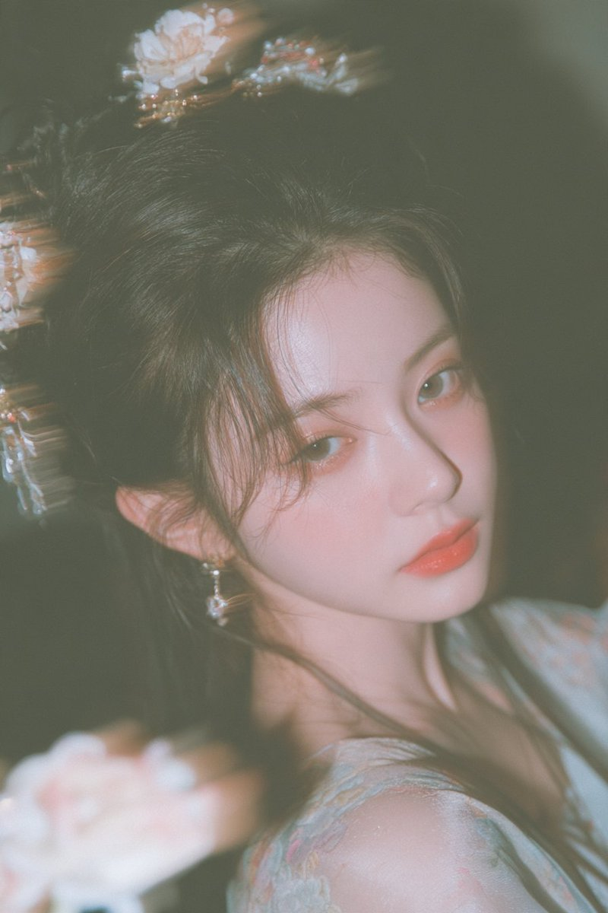
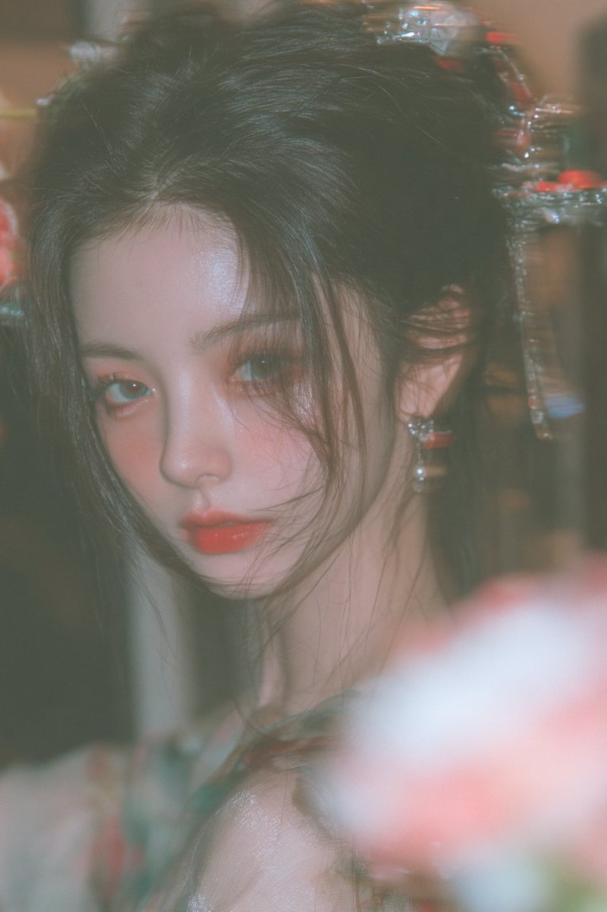
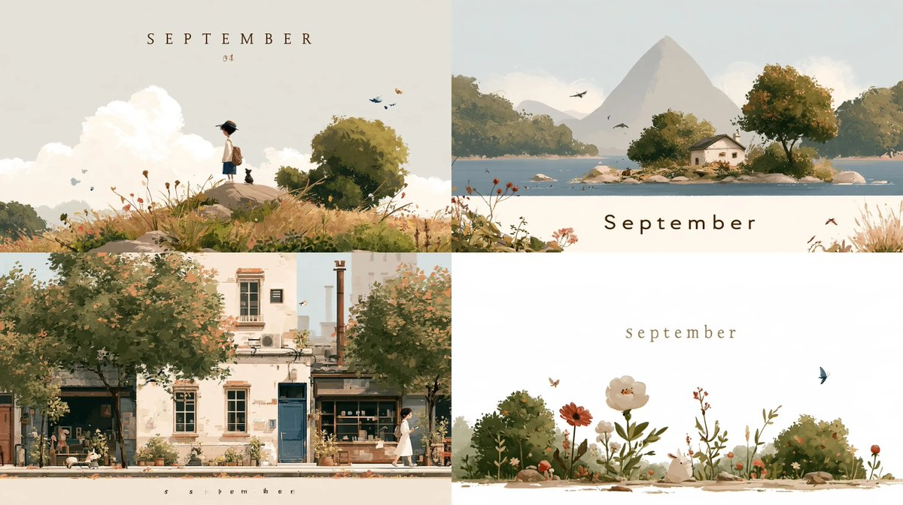

# Midjourney · Prompt Library · Leadde.ai

[](README.md) [](README_zh.md) [](README_zh-TW.md) [](README_ja-JP.md) [](README_ko-KR.md) [](README_th-TH.md) [](README_vi-VN.md) [](README_hi-IN.md) [](README_es-ES.md) [-lightgrey)](README_es-419.md) [](README_de-DE.md) [](README_fr-FR.md) [](README_it-IT.md) [-lightgrey)](README_pt-BR.md) [](README_pt-PT.md) [](README_tr-TR.md)

**Best for:** Midjourney prompts for art direction, campaign keyframes, concept development, and visual styles.

For PDF, PPT, SOP, training, and multilingual video workflows:
[Awesome Document-to-Video](https://github.com/LeaddeOpenLab/awesome-document-to-video)

> **High-quality prompts, curated daily**

Discover complete prompts for AI images, videos and 3D creation. Browse by style, explore multilingual editions and credit the original creators.

[Explore Leadde.ai →](https://leadde.ai/?utm_source=github&utm_medium=readme&utm_campaign=prompt-library&utm_content=midjourney)

## Meet Leadde.ai

Leadde.ai helps teams turn documents, slides and text into AI business videos for training, onboarding and marketing.

Star this repository to follow our daily prompt curation and find fresh creative ideas.

**20** Prompts · Latest addition: **2026-09-22**

<a name="catalog"></a>

## Browse by Category

[Photography](#category-photography) · [Cinematic / Film Still](#category-cinematic-film-still) · [Anime / Manga](#category-anime-manga) · [Illustration](#category-illustration) · [Comic / Graphic Novel](#category-comic-graphic-novel) · [Other](#category-other)

<a name="all-prompts"></a>

<a name="category-photography"></a>

## Photography

<a name="prompt-2102248515355505134"></a>

### Private boudoir in the inner chambers; soft-light CCD, blown highlights, heavy blur; full-body shot, Song-dynasty ancient style; vermilion lips and pearly teeth, swaying and graceful; beauty lives in the bone, not the skin. 9:16

Author：[@BubbleBrain](https://x.com/BubbleBrain) · [Source](https://x.com/BubbleBrain/status/2102248515355505134)

Photography · Portrait / Selfie · Published

**Summary:** Private boudoir in the inner chambers; soft-light CCD, blown highlights, heavy blur; full-body shot, Song-dynasty ancient style; vermilion lips and pearly teeth, swaying and graceful; beauty lives in the bone, not the skin. 9:16





**Prompt**

```text
Private boudoir in the inner chambers; soft-light CCD, blown highlights, heavy blur; full-body shot, Song-dynasty ancient style; vermilion lips and pearly teeth, swaying and graceful; beauty lives in the bone, not the skin. 9:16
```

[↑ Back to categories](#catalog)

---

<a name="prompt-2098364624613802381"></a>

### The female protagonist looks back with a smile under the pear blossom tree and shyly turns away, as the wind blows petals, fluttering her clothes and hair.

Author：[@PixelAigc](https://x.com/PixelAigc) · [Source](https://x.com/PixelAigc/status/2098364624613802381)

Photography · Published

Source：[@PixelAigc](https://x.com/PixelAigc) · [Source](https://x.com/PixelAigc/status/2098321856168398953)

**Summary:** The female protagonist looks back with a smile under the pear blossom tree and shyly turns away, as the wind blows petals, fluttering her clothes and hair.


**Prompt**

```text
The female protagonist turns her head to look at the camera, gives a gentle smile, and then shyly turns away; the wind blows, pear blossoms drift in the air, and her hair and clothes flutter in the breeze.
```

[↑ Back to categories](#catalog)

---

<a name="category-cinematic-film-still"></a>

## Cinematic / Film Still

<a name="prompt-2099327675244720565"></a>

### 15-second dark gothic storyboard: An Eastern woman in a tattered red wedding dress cries, laughs, and collapses in despair amid ancient architectural ruins in the drizzle.

Author：[@liluocheng13](https://x.com/liluocheng13) · [Source](https://x.com/liluocheng13/status/2099327675244720565)

Comic / Storyboard · Cinematic / Film Still · Architecture / Interior · Published

**Summary:** 15-second dark gothic storyboard: An Eastern woman in a tattered red wedding dress cries, laughs, and collapses in despair amid ancient architectural ruins in the drizzle.


**Prompt**

```text
Main subject: A hauntingly beautiful Eastern woman in a tattered crimson wedding gown and red veil, her silver hair disheveled. The background is the ruins of a collapsed ancient Chinese building, under a grey sky with light rain falling.\nStory storyboard (0–15 seconds):\n0–5s — Close-up and struggle: Camera slowly pushes in on the woman's face in close-up. Her eyes are unfocused, tears mixing with rain as they slide down her cheeks, yet an eerie smile plays at the corner of her mouth — her expression twisting between anguish and madness.\n5–10s — Stumbling and shattering: Camera follows her footsteps as she staggers unsteadily through the ruins, the hem of her wedding gown sweeping over rubble and dead branches with a soft rustling sound.\n10–15s — Despair and descent: Wide-angle shot pulls back as she collapses into a sitting position amid the ruins, the red veil slipping off to reveal her pale face. She tilts her head back toward the grey sky, her laughter fading as tears continue to fall.\nStyle and atmosphere: Cinematic quality, dark gothic style, high contrast, striking red-and-black visual impact, oppressive, despairing, surrealist, 8K resolution, exquisite detail.\nNegative: Low quality, stutter, face/body collapse, over-bright, excessive gore, stiff motion, watermark, T-pose, bright palette, flashy VFX, rigid camera, lack of speed/blur, weak kills.
```

[↑ Back to categories](#catalog)

---

<a name="prompt-2099114753662861645"></a>

### Video prompt of a girl looking back with a smile, turning her head to walk to the right, and stroking her hair.

Author：[@PixelAigc](https://x.com/PixelAigc) · [Source](https://x.com/PixelAigc/status/2099114753662861645)

Cinematic / Film Still · Character · Published

**Summary:** Video prompt of a girl looking back with a smile, turning her head to walk to the right, and stroking her hair.


**Prompt**

```text
The female protagonist smiles slightly at the camera, turns her face toward the right side of the frame, looks straight ahead, and continues walking to the right, she gently touches her hair with her left hand, the wind blows causing her hair to flutter, tracking camera shot, blurred background
```

[↑ Back to categories](#catalog)

---

<a name="prompt-2098392368487485484"></a>

### Cinematic portrait of an East Asian woman with high-contrast chiaroscuro lighting and embroidered white silk dress.

Author：[@woleswoosh](https://x.com/woleswoosh) · [Source](https://x.com/woleswoosh/status/2098392368487485484)

Cinematic / Film Still · Portrait / Selfie · Character · Fashion Item · Published

**Summary:** Cinematic portrait of an East Asian woman with high-contrast chiaroscuro lighting and embroidered white silk dress.


**Prompt**

```text
A cinematic close-up portrait of a young East Asian woman with pale porcelain skin and long, straight, glossy black hair falling over the left side of her face, several strands partially covering her left eye. She gazes directly at the camera with a calm, slightly mysterious expression. Soft pink-red lips, defined dark brows, subtle makeup. She wears an elegant white satin or silk one-shoulder garment with delicate embroidered floral lace patterns that catch the light. A long dangling crystal or jeweled earring hangs from her visible right ear.\n\nDramatic high-contrast lighting (chiaroscuro / Rembrandt-style): a single directional light source from the left illuminates the right side of her face, the curve of her cheek, lips, and the sheen of her hair, while the rest of her face and the entire background fall into deep, velvety black shadow. Dark, almost obsidian-black background with no visible details. Moody, elegant, intimate atmosphere. Photorealistic, ultra-detailed skin texture, individual hair strands, fabric sheen and embroidery, cinematic color grading with cool shadows and warm highlights on the skin.\n\nStyle keywords: dark academia portrait, high-fashion editorial photography, low-key lighting, shallow depth of field, 85mm lens look, masterpiece, 8k, highly detailed.
```

[↑ Back to categories](#catalog)

---

<a name="category-anime-manga"></a>

## Anime / Manga

<a name="prompt-2098818944673182032"></a>

### Generate early autumn anime illustrations using &quot;September&quot; as the core keyword combined with style reference codes.

Author：[@airina\_xyz](https://x.com/airina_xyz) · [Source](https://x.com/airina_xyz/status/2098818944673182032)

Anime / Manga · Illustration · Published

**Summary:** Generate early autumn anime illustrations using &quot;September&quot; as the core keyword combined with style reference codes.


**Prompt**

```text
September --ar 16:9 --sref 1674635905 980814165 1931977838
```

[↑ Back to categories](#catalog)

---

<a name="prompt-2098385016896336030"></a>

### A dynamic action scene depicting two Chinese goddess sisters wearing battle-damaged high-slit qipaos engaged in a deadly fight amidst blue and red flames, in ufotable anime style.

Author：[@asgam1ngx](https://x.com/asgam1ngx) · [Source](https://x.com/asgam1ngx/status/2098385016896336030)

Comic / Storyboard · Anime / Manga · Published

**Summary:** A dynamic action scene depicting two Chinese goddess sisters wearing battle-damaged high-slit qipaos engaged in a deadly fight amidst blue and red flames, in ufotable anime style.


**Prompt**

```text
anime masterpiece, dynamic action shot, 2 Chinese goddess sisters, voluptuous curvy body, high-slit silk qipao cheongsam, battle damaged clothing, blood splatters, glowing eyes, cinematic lighting, dramatic shadows, ufotable style, 8k --ar 9:16 --v 6.0
```

[↑ Back to categories](#catalog)

---

<a name="category-illustration"></a>

## Illustration

<a name="prompt-2102443819786809559"></a>

### An illustration prompt themed on September, containing specific style reference codes and an aspect ratio.

Author：[@airina\_xyz](https://x.com/airina_xyz) · [Source](https://x.com/airina_xyz/status/2102443819786809559)

Illustration · Published

**Summary:** An illustration prompt themed on September, containing specific style reference codes and an aspect ratio.



**Prompt**

```text
September --ar 16:9 --sref 4092060438 4141357725 1621964383
```

[↑ Back to categories](#catalog)

---

<a name="prompt-2102080930697613758"></a>

### Midjourney prompt using keyword 'September' and style reference seeds.

Author：[@airina\_xyz](https://x.com/airina_xyz) · [Source](https://x.com/airina_xyz/status/2102080930697613758)

Illustration · Published

**Summary:** Midjourney prompt using keyword 'September' and style reference seeds.


**Prompt**

```text
September --ar 16:9 --sref 2504006135 1902225729 461375124
```

[↑ Back to categories](#catalog)

---

<a name="prompt-2100269243774435679"></a>

### September-themed Midjourney illustration prompt with style references.

Author：[@airina\_xyz](https://x.com/airina_xyz) · [Source](https://x.com/airina_xyz/status/2100269243774435679)

Illustration · Published

**Summary:** September-themed Midjourney illustration prompt with style references.


**Prompt**

```text
September --ar 16:9 --sref 1095039279 3527724752 2108669540
```

[↑ Back to categories](#catalog)

---

<a name="prompt-2099543459707392043"></a>

### September --ar 16:9 --sref 3063123838 538684311 4236559069

Author：[@airina\_xyz](https://x.com/airina_xyz) · [Source](https://x.com/airina_xyz/status/2099543459707392043)

Illustration · Published

**Summary:** September --ar 16:9 --sref 3063123838 538684311 4236559069


**Prompt**

```text
September --ar 16:9 --sref 3063123838 538684311 4236559069
```

[↑ Back to categories](#catalog)

---

<a name="prompt-2099188369188372625"></a>

### Surreal illustration scene generated with the theme of &quot;September&quot; combined with specific style reference codes.

Author：[@airina\_xyz](https://x.com/airina_xyz) · [Source](https://x.com/airina_xyz/status/2099188369188372625)

Illustration · Published

**Summary:** Surreal illustration scene generated with the theme of &quot;September&quot; combined with specific style reference codes.


**Prompt**

```text
September --ar 16:9 --sref 1750398336 2622495067 588281222
```

[↑ Back to categories](#catalog)

---

<a name="prompt-2098456570678149630"></a>

### September-themed illustration prompt using Midjourney style references.

Author：[@airina\_xyz](https://x.com/airina_xyz) · [Source](https://x.com/airina_xyz/status/2098456570678149630)

Illustration · Published

**Summary:** September-themed illustration prompt using Midjourney style references.


**Prompt**

```text
September --ar 16:9 --sref 153692563 1979431158 2653758855
```

[↑ Back to categories](#catalog)

---

<a name="category-comic-graphic-novel"></a>

## Comic / Graphic Novel

<a name="prompt-2100931328422396328"></a>

### Generate an American comic graffiti style character using a specific sref style code.

Author：[@iX00AI2](https://x.com/iX00AI2) · [Source](https://x.com/iX00AI2/status/2100931328422396328)

Comic / Graphic Novel · Character · Published

Source：[@SREFCLUB](https://x.com/SREFCLUB) · [Source](https://x.com/SREFCLUB/status/2100890349929464237)

**Summary:** Generate an American comic graffiti style character using a specific sref style code.


**Prompt**

```text
Character --ar 3:4 --p --sref 2463148926
```

[↑ Back to categories](#catalog)

---

<a name="category-other"></a>

## Other

<a name="prompt-2101717035042615509"></a>

### September --ar 16:9 --sref 809527168 805544143 3641850946

Author：[@airina\_xyz](https://x.com/airina_xyz) · [Source](https://x.com/airina_xyz/status/2101717035042615509)

Other · Published

**Summary:** September --ar 16:9 --sref 809527168 805544143 3641850946


**Prompt**

```text
September --ar 16:9 --sref 809527168 805544143 3641850946
```

[↑ Back to categories](#catalog)

---

<a name="prompt-2101004838989631816"></a>

### Midjourney image generation prompt based on the &quot;September&quot; theme combined with specific style reference codes.

Author：[@airina\_xyz](https://x.com/airina_xyz) · [Source](https://x.com/airina_xyz/status/2101004838989631816)

Other · Published

**Summary:** Midjourney image generation prompt based on the &quot;September&quot; theme combined with specific style reference codes.


**Prompt**

```text
September --ar 16:9 --sref 1724923212 2901535857 1855620567
```

[↑ Back to categories](#catalog)

---

<a name="prompt-2100630123099930945"></a>

### Midjourney prompt themed on September with style reference IDs.

Author：[@airina\_xyz](https://x.com/airina_xyz) · [Source](https://x.com/airina_xyz/status/2100630123099930945)

Other · Published

**Summary:** Midjourney prompt themed on September with style reference IDs.


**Prompt**

```text
September --ar 16:9 --sref 1603183707 2430795563 3477797524
```

[↑ Back to categories](#catalog)

---

<a name="prompt-2099521272413909034"></a>

### One-shot sequence prompt of a particle giant whale leaping before a sea of clouds fairy palace and camera movement closing up on the palace.

Author：[@PixelAigc](https://x.com/PixelAigc) · [Source](https://x.com/PixelAigc/status/2099521272413909034)

Other · Published

**Summary:** One-shot sequence prompt of a particle giant whale leaping before a sea of clouds fairy palace and camera movement closing up on the palace.


**Prompt**

```text
One-shot sequence, the camera pushes in, orbital camera movement, wind blows over, clothes fluttering, clouds churning, a massive particle-effect whale leaps out from the clouds and mist, then dives back into the sea of clouds, the camera sweeps past the whale, and finally freezes on a close-up of the palace
```

[↑ Back to categories](#catalog)

---

<a name="prompt-2097086370301042925"></a>

### Corn wizard character concept blending Merlin and apprentice styles with corn background.

Author：[@teedubya](https://x.com/teedubya) · [Source](https://x.com/teedubya/status/2097086370301042925)

Character · Abstract / Background · Published

**Summary:** Corn wizard character concept blending Merlin and apprentice styles with corn background.


**Prompt**

```text
the corn wizard. Disney Apprentice meets Merlin the magician. Lots of work. Unreal Engine. 8k. Mysterious, Magnanamous, maximum ears of corn behind the corn man wizard in the center of the iconic image
```

[↑ Back to categories](#catalog)

---

<a name="prompt-2096629184512610370"></a>

### A thought visualized as a delicate transparent organism with glowing amber light and fine silver filaments unfurling in a dark chamber.

Author：[@Ror\_Fly](https://x.com/Ror_Fly) · [Source](https://x.com/Ror_Fly/status/2096629184512610370)

Animal / Creature · Published

**Summary:** A thought visualized as a delicate transparent organism with glowing amber light and fine silver filaments unfurling in a dark chamber.


**Prompt**

```text
A thought before it becomes a sentence. One small transparent organism suspended in the centre of an immense unfinished dark chamber, its body an intricate knot of clear capillaries holding a single warm amber light. Thousands of hair-fine silver filaments unfurl from it like the gills of a glass moth, branching outward into half-formed arches, folded translucent pages and faint botanical geometries; most dissolve into darkness before becoming objects. The nearest threads are painfully sharp, the distant structure barely suggested. A tiny pool of warm light beneath the creature, vast cold blue negative space above. Porcelain dust, delicate silica mesh, subtle copper contacts, a structure caught in the act of assembling itself. Dark-field photomicrograph with the impossible scale of architectural photography, volumetric backscatter, exquisite refractive edges, restrained cyan ivory and ember orange. Fragile, provisional, intensely attentive. --chaos 28 --ar 3:2 --profile mc9ebw2 hkb2ane qpfs1tj 2nqm1xw --stylize 800 --hd
```

[↑ Back to categories](#catalog)

---

[Explore Leadde.ai →](https://leadde.ai/?utm_source=github&utm_medium=readme&utm_campaign=prompt-library&utm_content=midjourney)
