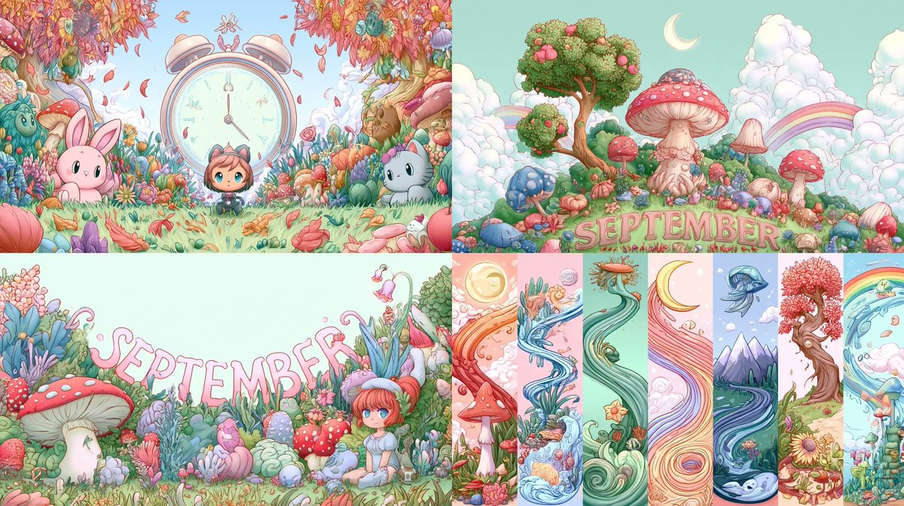

# Midjourney · Prompt-Bibliothek · Leadde.ai

[](README.md) [](README_zh.md) [](README_zh-TW.md) [](README_ja-JP.md) [](README_ko-KR.md) [](README_th-TH.md) [](README_vi-VN.md) [](README_hi-IN.md) [](README_es-ES.md) [-lightgrey)](README_es-419.md) [](README_de-DE.md) [](README_fr-FR.md) [](README_it-IT.md) [-lightgrey)](README_pt-BR.md) [](README_pt-PT.md) [](README_tr-TR.md)

**Best for:** Midjourney prompts for art direction, campaign keyframes, concept development, and visual styles.

For PDF, PPT, SOP, training, and multilingual video workflows:
[Awesome Document-to-Video](https://github.com/LeaddeOpenLab/awesome-document-to-video)

> **Hochwertige Prompts, täglich kuratiert**

Entdecke vollständige Prompts für KI-Bilder, Videos und 3D. Stöbere nach Stil, lies mehrsprachige Fassungen und finde die ursprünglichen Urheber und Quellen.

[Leadde.ai entdecken →](https://leadde.ai/?utm_source=github&utm_medium=readme&utm_campaign=prompt-library&utm_content=midjourney)

## Leadde.ai kennenlernen

Leadde.ai hilft Teams, Dokumente, Folien und Texte in KI-Geschäftsvideos für Schulungen, Onboarding und Marketing umzuwandeln.

Gib diesem Repository einen Stern, um unsere tägliche Prompt-Auswahl und neue kreative Ideen zu verfolgen.

**18** Prompts · Zuletzt hinzugefügt: **2026-09-21**

<a name="catalog"></a>

## Nach Kategorie durchsuchen

[Fotografie](#category-photography) · [Kinematisch / Filmstill](#category-cinematic-film-still) · [Anime / Manga](#category-anime-manga) · [Illustration](#category-illustration) · [Comic / Graphic Novel](#category-comic-graphic-novel) · [Sonstige](#category-other)

<a name="all-prompts"></a>

<a name="category-photography"></a>

## Fotografie

<a name="prompt-2098364624613802381"></a>

### Die weibliche Hauptfigur blickt unter einem Birnenbaum lächelnd zurück und dreht sich schüchtern weg, begleitet von im Wind wehenden Blütenblättern sowie flatterndem Haar und Gewand.

Autor：[@PixelAigc](https://x.com/PixelAigc) · [Originalbeitrag](https://x.com/PixelAigc/status/2098364624613802381)

Fotografie · Veröffentlicht

Originalbeitrag：[@PixelAigc](https://x.com/PixelAigc) · [Originalbeitrag](https://x.com/PixelAigc/status/2098321856168398953)

**Zusammenfassung:** Die weibliche Hauptfigur blickt unter einem Birnenbaum lächelnd zurück und dreht sich schüchtern weg, begleitet von im Wind wehenden Blütenblättern sowie flatterndem Haar und Gewand.


**Prompt**

```text
Die weibliche Hauptfigur dreht den Kopf zur Kamera, lächelt sanft und wendet sich dann schüchtern wieder ab; der Wind weht, Birnenblüten wirbeln durch die Luft, Haar und Kleidung wehen im Wind
```

[↑ Zurück zu Kategorien](#catalog)

---

<a name="category-cinematic-film-still"></a>

## Kinematisch / Filmstill

<a name="prompt-2099327675244720565"></a>

### 15-sekündiges Storyboard im Dark-Gothic-Stil: Eine fernöstliche Frau in einem zerfetzten roten Brautkleid weint, lacht und bricht verzweifelt in antiken Gebäuderuinen im leichten Nieselregen zusammen.

Autor：[@liluocheng13](https://x.com/liluocheng13) · [Originalbeitrag](https://x.com/liluocheng13/status/2099327675244720565)

Comic / Storyboard · Kinematisch / Filmstill · Architektur / Interieur · Veröffentlicht

**Zusammenfassung:** 15-sekündiges Storyboard im Dark-Gothic-Stil: Eine fernöstliche Frau in einem zerfetzten roten Brautkleid weint, lacht und bricht verzweifelt in antiken Gebäuderuinen im leichten Nieselregen zusammen.


**Prompt**

```text
Hauptmotiv: Eine unheimlich schöne fernöstliche Frau in einem zerfetzten karmesinroten Brautkleid und rotem Schleier, ihr silbernes Haar zerzaust. Der Hintergrund sind die Ruinen eines eingestürzten antiken chinesischen Gebäudes unter einem grauen Himmel bei leichtem Regen.
Story-Storyboard (0–15 Sekunden):
0–5s — Nahaufnahme und innerer Kampf: Die Kamera fährt in einer Nahaufnahme langsam an das Gesicht der Frau heran. Ihre Augen sind unruhig, Tränen vermischen sich mit dem Regen, während sie über ihre Wangen rinnen, doch ein unheimliches Lächeln umspielt ihren Mundwinkel – ihr Ausdruck schwankt zwischen Verzweiflung und Wahnsinn.
5–10s — Stolpern und Zerbrechen: Die Kamera folgt ihren Schritten, wie sie unsicher durch die Ruinen taumelt, während der Saum ihres Brautkleides mit einem leisen Rascheln über Schutt und tote Äste streift.
10–15s — Verzweiflung und Niedergang: Die Weitwinkelaufnahme zieht sich zurück, als sie inmitten der Ruinen in sich zusammensackt, während der rote Schleier herabgleitet und ihr blasses Gesicht enthüllt. Sie legt den Kopf in den Nacken zum grauen Himmel, ihr Lachen verblasst, während die Tränen weiter fließen.
Stil und Atmosphäre: Filmische Qualität, düsterer Gothic-Stil, hoher Kontrast, markante visuelle Wirkung in Rot und Schwarz, beklemmend, verzweifelt, surrealistisch, 8K-Auflösung, exquisite Details.
Negativ: Low quality, stutter, face/body collapse, over-bright, excessive gore, stiff motion, watermark, T-pose, bright palette, flashy VFX, rigid camera, lack of speed/blur, weak kills.
```

[↑ Zurück zu Kategorien](#catalog)

---

<a name="prompt-2099114753662861645"></a>

### Übersetzung läuft

Autor：[@PixelAigc](https://x.com/PixelAigc) · [Originalbeitrag](https://x.com/PixelAigc/status/2099114753662861645)

Kinematisch / Filmstill · Charakter · Veröffentlicht

**Zusammenfassung:** Übersetzung läuft


**Prompt**

```text
Übersetzung läuft
```

[↑ Zurück zu Kategorien](#catalog)

---

<a name="prompt-2098392368487485484"></a>

### Filmisches Porträt einer ostasiatischen Frau mit kontrastreicher Chiaroscuro-Beleuchtung und besticktem weißem Seidenkleid.

Autor：[@woleswoosh](https://x.com/woleswoosh) · [Originalbeitrag](https://x.com/woleswoosh/status/2098392368487485484)

Kinematisch / Filmstill · Porträt / Selfie · Charakter · Modeartikel · Veröffentlicht

**Zusammenfassung:** Filmisches Porträt einer ostasiatischen Frau mit kontrastreicher Chiaroscuro-Beleuchtung und besticktem weißem Seidenkleid.


**Prompt**

```text
Ein filmisches Nahaufnahme-Porträt einer jungen ostasiatischen Frau mit blasser Porzellanhaut und langem, glattem, glänzendem schwarzem Haar, das über die linke Seite ihres Gesichts fällt, wobei einige Strähnen ihr linkes Auge teilweise bedecken. Sie blickt mit einem ruhigen, leicht geheimnisvollen Ausdruck direkt in die Kamera. Sanfte rosa-rote Lippen, definierte dunkle Brauen, dezentes Make-up. Sie trägt ein elegantes One-Shoulder-Gewand aus weißem Satin oder Seide mit zarten bestickten floralen Spitzenmustern, die das Licht einfangen. Ein langer, baumelnder Kristall- oder Edelsteinohrring hängt an ihrem sichtbaren rechten Ohr.

Dramatische kontrastreiche Beleuchtung (Chiaroscuro / Rembrandt-Stil): Eine einzelne gerichtete Lichtquelle von links beleuchtet die rechte Seite ihres Gesichts, die Kurve ihrer Wange, die Lippen und den Glanz ihres Haares, während der Rest ihres Gesichts und der gesamte Hintergrund in tiefen, samtigen schwarzen Schatten versinken. Dunkler, fast obsidian-schwarzer Hintergrund ohne sichtbare Details. Stimmungsvolle, elegante, intime Atmosphäre. Fotorealistisch, extrem detaillierte Hauttextur, einzelne Haarsträhnen, Stoffglanz und Stickerei, filmisches Color Grading mit kühlen Schatten und warmen Glanzlichtern auf der Haut.

Stil-Schlüsselwörter: dark academia portrait, high-fashion editorial photography, low-key lighting, shallow depth of field, 85mm lens look, masterpiece, 8k, highly detailed.
```

[↑ Zurück zu Kategorien](#catalog)

---

<a name="category-anime-manga"></a>

## Anime / Manga

<a name="prompt-2098818944673182032"></a>

### Erstellung einer Anime-Illustration des Frühherbstes mit „September“ als Kernbegriff und kombiniert mit Stil-Referenzcodes.

Autor：[@airina\_xyz](https://x.com/airina_xyz) · [Originalbeitrag](https://x.com/airina_xyz/status/2098818944673182032)

Anime / Manga · Illustration · Veröffentlicht

**Zusammenfassung:** Erstellung einer Anime-Illustration des Frühherbstes mit „September“ als Kernbegriff und kombiniert mit Stil-Referenzcodes.


**Prompt**

```text
September --ar 16:9 --sref 1674635905 980814165 1931977838
```

[↑ Zurück zu Kategorien](#catalog)

---

<a name="prompt-2098385016896336030"></a>

### Eine dynamische Actionszene im ufotable-Anime-Stil, die zwei chinesische Göttinnen-Schwestern in kampfbeschädigtem Qipao mit hohem Schlitz bei einem Kampf auf Leben und Tod inmitten blauer und roter Flammen darstellt.

Autor：[@asgam1ngx](https://x.com/asgam1ngx) · [Originalbeitrag](https://x.com/asgam1ngx/status/2098385016896336030)

Comic / Storyboard · Anime / Manga · Veröffentlicht

**Zusammenfassung:** Eine dynamische Actionszene im ufotable-Anime-Stil, die zwei chinesische Göttinnen-Schwestern in kampfbeschädigtem Qipao mit hohem Schlitz bei einem Kampf auf Leben und Tod inmitten blauer und roter Flammen darstellt.


**Prompt**

```text
Anime-Meisterwerk, dynamische Action-Aufnahme, 2 chinesische Göttinnen-Schwestern, üppiger kurviger Körper, Seiden-Qipao-Cheongsam mit hohem Schlitz, kampfbeschädigte Kleidung, Blutspritzer, leuchtende Augen, filmische Beleuchtung, dramatische Schatten, ufotable-Stil, 8k --ar 9:16 --v 6.0
```

[↑ Zurück zu Kategorien](#catalog)

---

<a name="category-illustration"></a>

## Illustration

<a name="prompt-2102080930697613758"></a>

### Übersetzung läuft

Autor：[@airina\_xyz](https://x.com/airina_xyz) · [Originalbeitrag](https://x.com/airina_xyz/status/2102080930697613758)

Illustration · Veröffentlicht

**Zusammenfassung:** Übersetzung läuft



**Prompt**

```text
Übersetzung läuft
```

[↑ Zurück zu Kategorien](#catalog)

---

<a name="prompt-2100269243774435679"></a>

### Midjourney-Illustrations-Prompt zum Thema September mit Stilreferenzen.

Autor：[@airina\_xyz](https://x.com/airina_xyz) · [Originalbeitrag](https://x.com/airina_xyz/status/2100269243774435679)

Illustration · Veröffentlicht

**Zusammenfassung:** Midjourney-Illustrations-Prompt zum Thema September mit Stilreferenzen.


**Prompt**

```text
September --ar 16:9 --sref 1095039279 3527724752 2108669540
```

[↑ Zurück zu Kategorien](#catalog)

---

<a name="prompt-2099543459707392043"></a>

### September --ar 16:9 --sref 3063123838 538684311 4236559069

Autor：[@airina\_xyz](https://x.com/airina_xyz) · [Originalbeitrag](https://x.com/airina_xyz/status/2099543459707392043)

Illustration · Veröffentlicht

**Zusammenfassung:** September --ar 16:9 --sref 3063123838 538684311 4236559069


**Prompt**

```text
September --ar 16:9 --sref 3063123838 538684311 4236559069
```

[↑ Zurück zu Kategorien](#catalog)

---

<a name="prompt-2099188369188372625"></a>

### Surrealistische Illustrationsszene, generiert zum Thema „September“ in Kombination mit spezifischen Stil-Referenzcodes.

Autor：[@airina\_xyz](https://x.com/airina_xyz) · [Originalbeitrag](https://x.com/airina_xyz/status/2099188369188372625)

Illustration · Veröffentlicht

**Zusammenfassung:** Surrealistische Illustrationsszene, generiert zum Thema „September“ in Kombination mit spezifischen Stil-Referenzcodes.


**Prompt**

```text
September --ar 16:9 --sref 1750398336 2622495067 588281222
```

[↑ Zurück zu Kategorien](#catalog)

---

<a name="prompt-2098456570678149630"></a>

### Illustrations-Prompt zum Thema September unter Verwendung von Midjourney-Stilreferenzen.

Autor：[@airina\_xyz](https://x.com/airina_xyz) · [Originalbeitrag](https://x.com/airina_xyz/status/2098456570678149630)

Illustration · Veröffentlicht

**Zusammenfassung:** Illustrations-Prompt zum Thema September unter Verwendung von Midjourney-Stilreferenzen.


**Prompt**

```text
September --ar 16:9 --sref 153692563 1979431158 2653758855
```

[↑ Zurück zu Kategorien](#catalog)

---

<a name="category-comic-graphic-novel"></a>

## Comic / Graphic Novel

<a name="prompt-2100931328422396328"></a>

### Generiere einen Charakter im US-Comic-Graffiti-Stil mithilfe eines bestimmten sref-Stilcodes.

Autor：[@iX00AI2](https://x.com/iX00AI2) · [Originalbeitrag](https://x.com/iX00AI2/status/2100931328422396328)

Comic / Graphic Novel · Charakter · Veröffentlicht

Originalbeitrag：[@SREFCLUB](https://x.com/SREFCLUB) · [Originalbeitrag](https://x.com/SREFCLUB/status/2100890349929464237)

**Zusammenfassung:** Generiere einen Charakter im US-Comic-Graffiti-Stil mithilfe eines bestimmten sref-Stilcodes.


**Prompt**

```text
Charakter --ar 3:4 --p --sref 2463148926
```

[↑ Zurück zu Kategorien](#catalog)

---

<a name="category-other"></a>

## Sonstige

<a name="prompt-2101717035042615509"></a>

### September --ar 16:9 --sref 809527168 805544143 3641850946

Autor：[@airina\_xyz](https://x.com/airina_xyz) · [Originalbeitrag](https://x.com/airina_xyz/status/2101717035042615509)

Sonstige · Veröffentlicht

**Zusammenfassung:** September --ar 16:9 --sref 809527168 805544143 3641850946


**Prompt**

```text
September --ar 16:9 --sref 809527168 805544143 3641850946
```

[↑ Zurück zu Kategorien](#catalog)

---

<a name="prompt-2101004838989631816"></a>

### Midjourney-Bildgenerierungs-Prompt basierend auf dem Thema „September“ in Kombination mit spezifischen Stil-Referenzcodes.

Autor：[@airina\_xyz](https://x.com/airina_xyz) · [Originalbeitrag](https://x.com/airina_xyz/status/2101004838989631816)

Sonstige · Veröffentlicht

**Zusammenfassung:** Midjourney-Bildgenerierungs-Prompt basierend auf dem Thema „September“ in Kombination mit spezifischen Stil-Referenzcodes.


**Prompt**

```text
September --ar 16:9 --sref 1724923212 2901535857 1855620567
```

[↑ Zurück zu Kategorien](#catalog)

---

<a name="prompt-2100630123099930945"></a>

### Midjourney-Prompt zum Thema September mit Stilreferenz-IDs.

Autor：[@airina\_xyz](https://x.com/airina_xyz) · [Originalbeitrag](https://x.com/airina_xyz/status/2100630123099930945)

Sonstige · Veröffentlicht

**Zusammenfassung:** Midjourney-Prompt zum Thema September mit Stilreferenz-IDs.


**Prompt**

```text
September --ar 16:9 --sref 1603183707 2430795563 3477797524
```

[↑ Zurück zu Kategorien](#catalog)

---

<a name="prompt-2099521272413909034"></a>

### One-Shot-Prompt mit einem riesigen Partikelwal, der vor einem Himmelspalast aus dem Wolkenmeer springt, mit Kamerafahrt zur Nahaufnahme des Palastes.

Autor：[@PixelAigc](https://x.com/PixelAigc) · [Originalbeitrag](https://x.com/PixelAigc/status/2099521272413909034)

Sonstige · Veröffentlicht

**Zusammenfassung:** One-Shot-Prompt mit einem riesigen Partikelwal, der vor einem Himmelspalast aus dem Wolkenmeer springt, mit Kamerafahrt zur Nahaufnahme des Palastes.


**Prompt**

```text
One-Shot, Kamera fährt vor, Kamera umkreist, Wind weht, Kleidung flattert, Wolken und Nebel wogen, ein riesiger Wal mit Partikeleffekt springt aus dem Nebel empor und taucht dann wieder in das Wolkenmeer ein, die Kamera gleitet am Wal vorbei und friert schließlich in einer Nahaufnahme des Palastes ein
```

[↑ Zurück zu Kategorien](#catalog)

---

<a name="prompt-2097086370301042925"></a>

### Charakterkonzept eines Mais-Zauberers, das die Stile von Merlin und dem Zauberlehrling mit einem Mais-Hintergrund verbindet.

Autor：[@teedubya](https://x.com/teedubya) · [Originalbeitrag](https://x.com/teedubya/status/2097086370301042925)

Charakter · Zusammenfassung / Hintergrund · Veröffentlicht

**Zusammenfassung:** Charakterkonzept eines Mais-Zauberers, das die Stile von Merlin und dem Zauberlehrling mit einem Mais-Hintergrund verbindet.


**Prompt**

```text
Der Mais-Zauberer. Disney-Lehrling trifft auf Merlin den Zauberer. Viel Arbeit. Unreal Engine. 8k. Geheimnisvoll, großmütig, maximale Maiskolben hinter dem Mais-Mann-Zauberer im Zentrum des ikonischen Bildes
```

[↑ Zurück zu Kategorien](#catalog)

---

<a name="prompt-2096629184512610370"></a>

### Ein Gedanke, visualisiert als zarter transparenter Organismus mit glühendem bernsteinfarbenem Licht und feinen Silberfäden, die sich in einer dunklen Kammer entfalten.

Autor：[@Ror\_Fly](https://x.com/Ror_Fly) · [Originalbeitrag](https://x.com/Ror_Fly/status/2096629184512610370)

Tier / Kreatur · Veröffentlicht

**Zusammenfassung:** Ein Gedanke, visualisiert als zarter transparenter Organismus mit glühendem bernsteinfarbenem Licht und feinen Silberfäden, die sich in einer dunklen Kammer entfalten.


**Prompt**

```text
Ein Gedanke, bevor er zu einem Satz wird. Ein kleiner transparenter Organismus, der in der Mitte einer riesigen unvollendeten dunklen Kammer schwebt, sein Körper ein verschlungener Knoten aus klaren Kapillaren, die ein einzelnes warmes bernsteinfarbenes Licht bergen. Tausende haardünne Silberfäden entfalten sich aus ihm wie die Kiemen einer Glasmotte, verzweigen sich nach außen in halb geformte Bögen, gefaltete durchscheinende Seiten und zarte botanische Geometrien; die meisten lösen sich in Dunkelheit auf, bevor sie zu Objekten werden. Die nächsten Fäden sind schmerzhaft scharf, die entfernte Struktur kaum angedeutet. Eine winzige Lache warmen Lichts unter der Kreatur, riesiger kalter blauer Negativraum darüber. Porzellanstaub, zartes Siliziumdioxid-Geflecht, subtile Kupferkontakte, eine Struktur, die auf frischer Tat ertappt wurde, wie sie sich selbst zusammenbaut. Dunkelfeld-Mikrofotografie mit dem unmöglichen Maßstab von Architekturfotografie, volumetrische Rückstreuung, exquisite lichtbrechende Kanten, zurückhaltendes Cyan, Elfenbein und Glut-Orange. Zerbrechlich, provisorisch, intensiv aufmerksam. --chaos 28 --ar 3:2 --profile mc9ebw2 hkb2ane qpfs1tj 2nqm1xw --stylize 800 --hd
```

[↑ Zurück zu Kategorien](#catalog)

---

[Leadde.ai entdecken →](https://leadde.ai/?utm_source=github&utm_medium=readme&utm_campaign=prompt-library&utm_content=midjourney)
