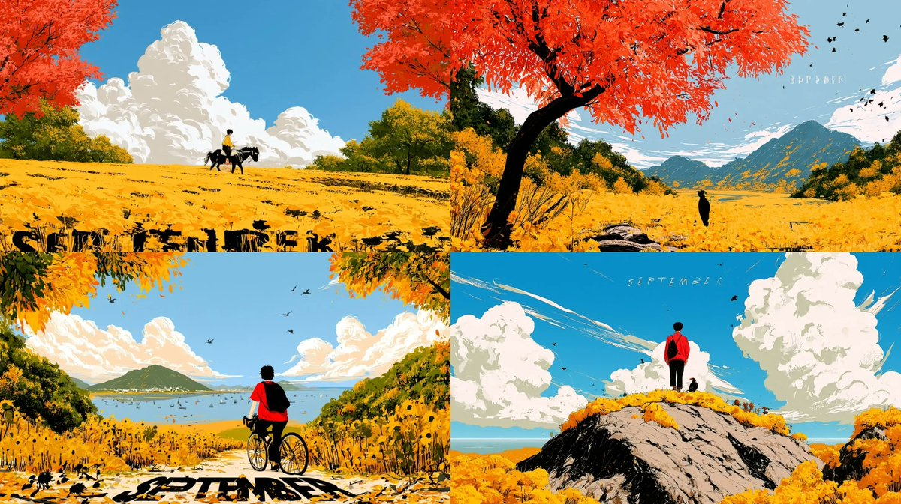
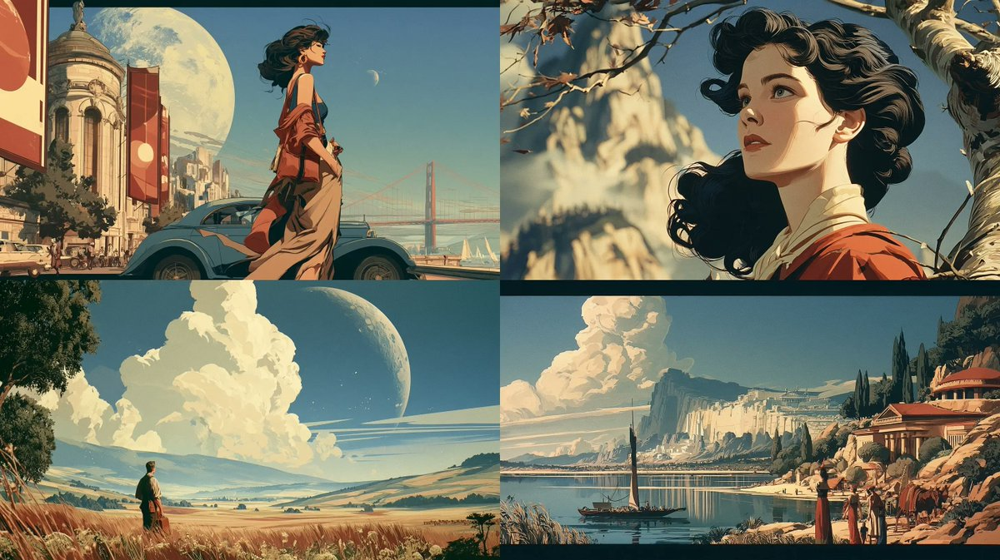

# Midjourney · Biblioteca de prompts · Leadde.ai

[](README.md) [](README_zh.md) [](README_zh-TW.md) [](README_ja-JP.md) [](README_ko-KR.md) [](README_th-TH.md) [](README_vi-VN.md) [](README_hi-IN.md) [](README_es-ES.md) [-brightgreen)](README_es-419.md) [](README_de-DE.md) [](README_fr-FR.md) [](README_it-IT.md) [-lightgrey)](README_pt-BR.md) [](README_pt-PT.md) [](README_tr-TR.md)

**Best for:** Midjourney prompts for art direction, campaign keyframes, concept development, and visual styles.

For PDF, PPT, SOP, training, and multilingual video workflows:
[Awesome Document-to-Video](https://github.com/LeaddeOpenLab/awesome-document-to-video)

> **Prompts de calidad seleccionados cada día**

Descubre prompts completos para crear imágenes, videos y 3D con IA. Explora por estilo, consulta versiones multilingües y encuentra a los autores originales.

[Explora Leadde.ai →](https://leadde.ai/?utm_source=github&utm_medium=readme&utm_campaign=prompt-library&utm_content=midjourney)

## Conoce Leadde.ai

Leadde.ai ayuda a los equipos a convertir documentos, diapositivas y texto en videos empresariales con IA para capacitación, incorporación y marketing.

Dale una estrella a este repositorio para seguir nuestra selección diaria y descubrir nuevas ideas creativas.

**17** Prompts · Última incorporación: **2026-09-20**

<a name="catalog"></a>

## Explorar por categoría

[Fotografía](#category-photography) · [Cine / Fotograma](#category-cinematic-film-still) · [Anime / Manga](#category-anime-manga) · [Ilustración](#category-illustration) · [Cómic / Novela gráfica](#category-comic-graphic-novel) · [Otros](#category-other)

<a name="all-prompts"></a>

<a name="category-photography"></a>

## Fotografía

<a name="prompt-2098364624613802381"></a>

### La protagonista sonríe al mirar atrás bajo un peral y se vuelve tímidamente, acompañada por pétalos que vuelan con el viento y ropa y cabello ondeando.

Autor：[@PixelAigc](https://x.com/PixelAigc) · [Publicación original](https://x.com/PixelAigc/status/2098364624613802381)

Fotografía · Publicado

Publicación original：[@PixelAigc](https://x.com/PixelAigc) · [Publicación original](https://x.com/PixelAigc/status/2098321856168398953)

**Resumen:** La protagonista sonríe al mirar atrás bajo un peral y se vuelve tímidamente, acompañada por pétalos que vuelan con el viento y ropa y cabello ondeando.


**Prompt**

```text
La protagonista gira la cabeza hacia la cámara, sonríe levemente y se vuelve tímidamente; sopla el viento, flotan flores de peral y su cabello y su ropa ondean con la brisa
```

[↑ Volver a categorías](#catalog)

---

<a name="category-cinematic-film-still"></a>

## Cine / Fotograma

<a name="prompt-2099327675244720565"></a>

### Guion gráfico de estilo gótico oscuro de 15 segundos: una mujer oriental con un vestido de novia rojo andrajoso llora, ríe y se desploma desesperada entre ruinas arquitectónicas antiguas bajo la llovizna.

Autor：[@liluocheng13](https://x.com/liluocheng13) · [Publicación original](https://x.com/liluocheng13/status/2099327675244720565)

Cómic / Guion gráfico · Cine / Fotograma · Arquitectura / Interiores · Publicado

**Resumen:** Guion gráfico de estilo gótico oscuro de 15 segundos: una mujer oriental con un vestido de novia rojo andrajoso llora, ríe y se desploma desesperada entre ruinas arquitectónicas antiguas bajo la llovizna.


**Prompt**

```text
Sujeto principal: Una mujer oriental inquietantemente hermosa con un vestido de novia carmesí andrajoso y un velo rojo, con su cabello plateado despeinado. El fondo son las ruinas de un edificio chino antiguo derrumbado, bajo un cielo gris con una ligera llovizna cayendo.
Guión gráfico narrativo (0–15 segundos):
0–5s — Primer plano y lucha: La cámara se acerca lentamente al rostro de la mujer en un primer plano. Sus ojos están desenfocados, las lágrimas se mezclan con la lluvia mientras resbalan por sus mejillas, pero una sonrisa espeluznante se dibuja en la comisura de su boca; su expresión se retuerce entre la angustia y la locura.
5–10s — Tropezón y quebranto: La cámara sigue sus pasos mientras se tambalea vacilante por las ruinas, el dobladillo de su vestido de novia barre los escombros y las ramas secas con un suave crujido.
10–15s — Desesperación y caída: La toma en gran angular se aleja mientras ella se desploma sentada entre las ruinas, el velo rojo resbalando para revelar su rostro pálido. Inclina la cabeza hacia atrás mirando al cielo gris, su risa se desvanece mientras las lágrimas continúan cayendo.
Estilo y atmósfera: Calidad cinematográfica, estilo gótico oscuro, alto contraste, impactante efecto visual rojo y negro, opresivo, desesperante, surrealista, resolución 8K, detalles exquisitos.
Negativo: Low quality, stutter, face/body collapse, over-bright, excessive gore, stiff motion, watermark, T-pose, bright palette, flashy VFX, rigid camera, lack of speed/blur, weak kills.
```

[↑ Volver a categorías](#catalog)

---

<a name="prompt-2099114753662861645"></a>

### Traducción en curso

Autor：[@PixelAigc](https://x.com/PixelAigc) · [Publicación original](https://x.com/PixelAigc/status/2099114753662861645)

Cine / Fotograma · Personaje · Publicado

**Resumen:** Traducción en curso


**Prompt**

```text
Traducción en curso
```

[↑ Volver a categorías](#catalog)

---

<a name="prompt-2098392368487485484"></a>

### Retrato cinematográfico de una mujer de Asia oriental con iluminación en claroscuro de alto contraste y vestido de seda blanca bordada.

Autor：[@woleswoosh](https://x.com/woleswoosh) · [Publicación original](https://x.com/woleswoosh/status/2098392368487485484)

Cine / Fotograma · Retrato / Selfie · Personaje · Artículo de moda · Publicado

**Resumen:** Retrato cinematográfico de una mujer de Asia oriental con iluminación en claroscuro de alto contraste y vestido de seda blanca bordada.


**Prompt**

```text
Un retrato cinematográfico en primer plano de una joven mujer de Asia oriental con piel pálida de porcelana y cabello negro, largo, lacio y brillante que cae sobre el lado izquierdo de su rostro, con varios mechones cubriendo parcialmente su ojo izquierdo. Mira directamente a la cámara con una expresión serena y ligeramente misteriosa. Labios en tono rojo rosado suave, cejas oscuras y definidas, maquillaje sutil. Viste una elegante prenda de satén o seda blanca de un solo hombro con delicados patrones florales de encaje bordado que capturan la luz. Un pendiente largo y colgante de cristal o pedrería pende de su oreja derecha visible.

Iluminación dramática de alto contraste (claroscuro / estilo Rembrandt): una única fuente de luz direccional desde la izquierda ilumina el lado derecho de su rostro, la curva de su mejilla, los labios y el brillo de su cabello, mientras que el resto de su rostro y todo el fondo se sumergen en sombras negras profundas y aterciopeladas. Fondo oscuro, casi negro obsidiana, sin detalles visibles. Atmósfera melancólica, elegante e íntima. Fotorrealista, textura de la piel ultradetallada, hebras de cabello individuales, brillo de la tela y bordado, gradación de color cinematográfica con sombras frías y luces cálidas sobre la piel.

Palabras clave de estilo: dark academia portrait, high-fashion editorial photography, low-key lighting, shallow depth of field, 85mm lens look, masterpiece, 8k, highly detailed.
```

[↑ Volver a categorías](#catalog)

---

<a name="category-anime-manga"></a>

## Anime / Manga

<a name="prompt-2098818944673182032"></a>

### Generar una ilustración de anime de principios de otoño con &quot;September&quot; como palabra clave y combinada con códigos de referencia de estilo.

Autor：[@airina\_xyz](https://x.com/airina_xyz) · [Publicación original](https://x.com/airina_xyz/status/2098818944673182032)

Anime / Manga · Ilustración · Publicado

**Resumen:** Generar una ilustración de anime de principios de otoño con &quot;September&quot; como palabra clave y combinada con códigos de referencia de estilo.


**Prompt**

```text
Septiembre --ar 16:9 --sref 1674635905 980814165 1931977838
```

[↑ Volver a categorías](#catalog)

---

<a name="prompt-2098385016896336030"></a>

### Una escena de acción dinámica con estilo anime de ufotable que representa a dos hermanas diosas chinas vestidas con qipaos de abertura alta dañados por la batalla en un combate a muerte entre llamas azules y rojas.

Autor：[@asgam1ngx](https://x.com/asgam1ngx) · [Publicación original](https://x.com/asgam1ngx/status/2098385016896336030)

Cómic / Guion gráfico · Anime / Manga · Publicado

**Resumen:** Una escena de acción dinámica con estilo anime de ufotable que representa a dos hermanas diosas chinas vestidas con qipaos de abertura alta dañados por la batalla en un combate a muerte entre llamas azules y rojas.


**Prompt**

```text
obra maestra de anime, toma de acción dinámica, 2 hermanas diosas chinas, cuerpo curvilíneo y voluptuoso, qipao cheongsam de seda con abertura alta, ropa dañada por la batalla, salpicaduras de sangre, ojos brillantes, iluminación cinematográfica, sombras dramáticas, estilo ufotable, 8k --ar 9:16 --v 6.0
```

[↑ Volver a categorías](#catalog)

---

<a name="category-illustration"></a>

## Ilustración

<a name="prompt-2100269243774435679"></a>

### Prompt de ilustración de Midjourney con temática de septiembre y referencias de estilo.

Autor：[@airina\_xyz](https://x.com/airina_xyz) · [Publicación original](https://x.com/airina_xyz/status/2100269243774435679)

Ilustración · Publicado

**Resumen:** Prompt de ilustración de Midjourney con temática de septiembre y referencias de estilo.


**Prompt**

```text
Septiembre --ar 16:9 --sref 1095039279 3527724752 2108669540
```

[↑ Volver a categorías](#catalog)

---

<a name="prompt-2099543459707392043"></a>

### Septiembre --ar 16:9 --sref 3063123838 538684311 4236559069

Autor：[@airina\_xyz](https://x.com/airina_xyz) · [Publicación original](https://x.com/airina_xyz/status/2099543459707392043)

Ilustración · Publicado

**Resumen:** Septiembre --ar 16:9 --sref 3063123838 538684311 4236559069


**Prompt**

```text
Septiembre --ar 16:9 --sref 3063123838 538684311 4236559069
```

[↑ Volver a categorías](#catalog)

---

<a name="prompt-2099188369188372625"></a>

### Escena de ilustración surrealista generada con el tema &quot;Septiembre&quot; combinada con códigos de referencia de estilo específicos.

Autor：[@airina\_xyz](https://x.com/airina_xyz) · [Publicación original](https://x.com/airina_xyz/status/2099188369188372625)

Ilustración · Publicado

**Resumen:** Escena de ilustración surrealista generada con el tema &quot;Septiembre&quot; combinada con códigos de referencia de estilo específicos.


**Prompt**

```text
Septiembre --ar 16:9 --sref 1750398336 2622495067 588281222
```

[↑ Volver a categorías](#catalog)

---

<a name="prompt-2098456570678149630"></a>

### Prompt de ilustración con temática de septiembre utilizando referencias de estilo de Midjourney.

Autor：[@airina\_xyz](https://x.com/airina_xyz) · [Publicación original](https://x.com/airina_xyz/status/2098456570678149630)

Ilustración · Publicado

**Resumen:** Prompt de ilustración con temática de septiembre utilizando referencias de estilo de Midjourney.


**Prompt**

```text
Septiembre --ar 16:9 --sref 153692563 1979431158 2653758855
```

[↑ Volver a categorías](#catalog)

---

<a name="category-comic-graphic-novel"></a>

## Cómic / Novela gráfica

<a name="prompt-2100931328422396328"></a>

### Genera un personaje al estilo grafiti de cómic estadounidense usando un código de estilo sref específico.

Autor：[@iX00AI2](https://x.com/iX00AI2) · [Publicación original](https://x.com/iX00AI2/status/2100931328422396328)

Cómic / Novela gráfica · Personaje · Publicado

Publicación original：[@SREFCLUB](https://x.com/SREFCLUB) · [Publicación original](https://x.com/SREFCLUB/status/2100890349929464237)

**Resumen:** Genera un personaje al estilo grafiti de cómic estadounidense usando un código de estilo sref específico.


**Prompt**

```text
Personaje --ar 3:4 --p --sref 2463148926
```

[↑ Volver a categorías](#catalog)

---

<a name="category-other"></a>

## Otros

<a name="prompt-2101717035042615509"></a>

### Traducción en curso

Autor：[@airina\_xyz](https://x.com/airina_xyz) · [Publicación original](https://x.com/airina_xyz/status/2101717035042615509)

Otros · Publicado

**Resumen:** Traducción en curso



**Prompt**

```text
Traducción en curso
```

[↑ Volver a categorías](#catalog)

---

<a name="prompt-2101004838989631816"></a>

### Prompt de generación de imágenes de Midjourney basado en el tema &quot;septiembre&quot; combinado con códigos de referencia de estilo específicos.

Autor：[@airina\_xyz](https://x.com/airina_xyz) · [Publicación original](https://x.com/airina_xyz/status/2101004838989631816)

Otros · Publicado

**Resumen:** Prompt de generación de imágenes de Midjourney basado en el tema &quot;septiembre&quot; combinado con códigos de referencia de estilo específicos.



**Prompt**

```text
Septiembre --ar 16:9 --sref 1724923212 2901535857 1855620567
```

[↑ Volver a categorías](#catalog)

---

<a name="prompt-2100630123099930945"></a>

### Prompt de Midjourney temático de septiembre con IDs de referencia de estilo.

Autor：[@airina\_xyz](https://x.com/airina_xyz) · [Publicación original](https://x.com/airina_xyz/status/2100630123099930945)

Otros · Publicado

**Resumen:** Prompt de Midjourney temático de septiembre con IDs de referencia de estilo.


**Prompt**

```text
Septiembre --ar 16:9 --sref 1603183707 2430795563 3477797524
```

[↑ Volver a categorías](#catalog)

---

<a name="prompt-2099521272413909034"></a>

### Prompt de plano secuencia de una ballena gigante de partículas saltando frente a un palacio celestial en un mar de nubes y movimiento de cámara a primer plano del palacio.

Autor：[@PixelAigc](https://x.com/PixelAigc) · [Publicación original](https://x.com/PixelAigc/status/2099521272413909034)

Otros · Publicado

**Resumen:** Prompt de plano secuencia de una ballena gigante de partículas saltando frente a un palacio celestial en un mar de nubes y movimiento de cámara a primer plano del palacio.


**Prompt**

```text
Plano secuencia continuo, la cámara avanza, la cámara se mueve alrededor, sopla el viento, la ropa ondea, las nubes y la niebla se agitan, una ballena gigante con efecto de partículas salta de entre la niebla y luego se sumerge de nuevo en el mar de nubes, la cámara pasa rozando a la ballena y finalmente se detiene en un primer plano del palacio
```

[↑ Volver a categorías](#catalog)

---

<a name="prompt-2097086370301042925"></a>

### Concepto de personaje del mago del maíz que combina los estilos de Merlín y aprendiz con un fondo de maíz.

Autor：[@teedubya](https://x.com/teedubya) · [Publicación original](https://x.com/teedubya/status/2097086370301042925)

Personaje · Resumen / Antecedentes · Publicado

**Resumen:** Concepto de personaje del mago del maíz que combina los estilos de Merlín y aprendiz con un fondo de maíz.


**Prompt**

```text
el mago del maíz. El aprendiz de Disney se encuentra con Merlín el mago. Mucho trabajo. Unreal Engine. 8k. Misterioso, magnánimo, máxima cantidad de mazorcas de maíz detrás del hombre mago de maíz en el centro de la imagen icónica
```

[↑ Volver a categorías](#catalog)

---

<a name="prompt-2096629184512610370"></a>

### Un pensamiento visualizado como un delicado organismo transparente con una brillante luz ámbar y finos filamentos plateados desplegándose en una cámara oscura.

Autor：[@Ror\_Fly](https://x.com/Ror_Fly) · [Publicación original](https://x.com/Ror_Fly/status/2096629184512610370)

Animal / Criatura · Publicado

**Resumen:** Un pensamiento visualizado como un delicado organismo transparente con una brillante luz ámbar y finos filamentos plateados desplegándose en una cámara oscura.


**Prompt**

```text
Un pensamiento antes de convertirse en oración. Un pequeño organismo transparente suspendido en el centro de una inmensa cámara oscura inacabada, su cuerpo un intrincado nudo de capilares transparentes que contienen una única y cálida luz ámbar. Miles de filamentos plateados tan finos como cabellos se despliegan de él como las branquias de una polilla de cristal, ramificándose hacia afuera en arcos a medio formar, páginas translúcidas plegadas y tenues geometrías botánicas; la mayoría se disuelve en la oscuridad antes de convertirse en objetos. Los hilos más cercanos son dolorosamente nítidos, la estructura lejana apenas sugerida. Un diminuto charco de luz cálida debajo de la criatura, un vasto espacio negativo azul frío arriba. Polvo de porcelana, delicada malla de sílice, sutiles contactos de cobre, una estructura atrapada en el acto de autoensamblarse. Fotomicrografía de campo oscuro con la escala imposible de la fotografía arquitectónica, retrodispersión volumétrica, exquisitos bordes refractivos, cian comedido, marfil y naranja ascua. Frágil, provisional, intensamente atento. --chaos 28 --ar 3:2 --profile mc9ebw2 hkb2ane qpfs1tj 2nqm1xw --stylize 800 --hd
```

[↑ Volver a categorías](#catalog)

---

[Explora Leadde.ai →](https://leadde.ai/?utm_source=github&utm_medium=readme&utm_campaign=prompt-library&utm_content=midjourney)
