# Midjourney · Bibliothèque de prompts · Leadde.ai

[](README.md) [](README_zh.md) [](README_zh-TW.md) [](README_ja-JP.md) [](README_ko-KR.md) [](README_th-TH.md) [](README_vi-VN.md) [](README_hi-IN.md) [](README_es-ES.md) [-lightgrey)](README_es-419.md) [](README_de-DE.md) [](README_fr-FR.md) [](README_it-IT.md) [-lightgrey)](README_pt-BR.md) [](README_pt-PT.md) [](README_tr-TR.md)

**Best for:** Midjourney prompts for art direction, campaign keyframes, concept development, and visual styles.

For PDF, PPT, SOP, training, and multilingual video workflows:
[Awesome Document-to-Video](https://github.com/LeaddeOpenLab/awesome-document-to-video)

> **Des prompts de qualité sélectionnés chaque jour**

Découvrez des prompts complets pour créer des images, des vidéos et de la 3D avec l’IA. Explorez les styles, les versions multilingues et les sources des créateurs.

[Explorer Leadde.ai →](https://leadde.ai/?utm_source=github&utm_medium=readme&utm_campaign=prompt-library&utm_content=midjourney)

## Découvrez Leadde.ai

Leadde.ai aide les équipes à transformer documents, diapositives et textes en vidéos professionnelles avec l’IA pour la formation, l’intégration et le marketing.

Ajoutez une étoile à ce dépôt pour suivre notre sélection quotidienne de prompts et trouver de nouvelles idées.

**6** Prompts · Dernier ajout: **2026-09-11**

<a name="catalog"></a>

## Parcourir par catégorie

[Photographie](#category-photography) · [Image cinématographique / Photogramme de film](#category-cinematic-film-still) · [Anime / Manga](#category-anime-manga) · [Illustration](#category-illustration) · [Autres](#category-other)

<a name="all-prompts"></a>

<a name="category-photography"></a>

## Photographie

<a name="prompt-2098364624613802381"></a>

### L'héroïne sourit en se retournant sous un poirier puis se détourne timidement, accompagnée de pétales portés par le vent et de vêtements et cheveux flottants.

Auteur：[@PixelAigc](https://x.com/PixelAigc) · [Publication originale](https://x.com/PixelAigc/status/2098364624613802381)

Photographie · Publié

Publication originale：[@PixelAigc](https://x.com/PixelAigc) · [Publication originale](https://x.com/PixelAigc/status/2098321856168398953)

**Résumé:** L'héroïne sourit en se retournant sous un poirier puis se détourne timidement, accompagnée de pétales portés par le vent et de vêtements et cheveux flottants.

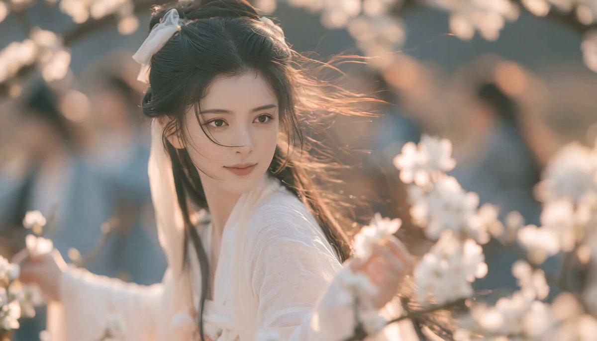

**Consigne**

```text
L'héroïne tourne la tête vers la caméra, esquisse un léger sourire, puis se détourne timidement ; le vent souffle, les fleurs de poirier tourbillonnent, ses cheveux et ses vêtements flottent au vent
```

[↑ Retour aux catégories](#catalog)

---

<a name="category-cinematic-film-still"></a>

## Image cinématographique / Photogramme de film

<a name="prompt-2098392368487485484"></a>

### Portrait cinématographique d'une femme est-asiatique avec un éclairage en clair-obscur à fort contraste et une robe en soie blanche brodée.

Auteur：[@woleswoosh](https://x.com/woleswoosh) · [Publication originale](https://x.com/woleswoosh/status/2098392368487485484)

Image cinématographique / Photogramme de film · Portrait / Selfie · Personnage · Article de mode · Publié

**Résumé:** Portrait cinématographique d'une femme est-asiatique avec un éclairage en clair-obscur à fort contraste et une robe en soie blanche brodée.

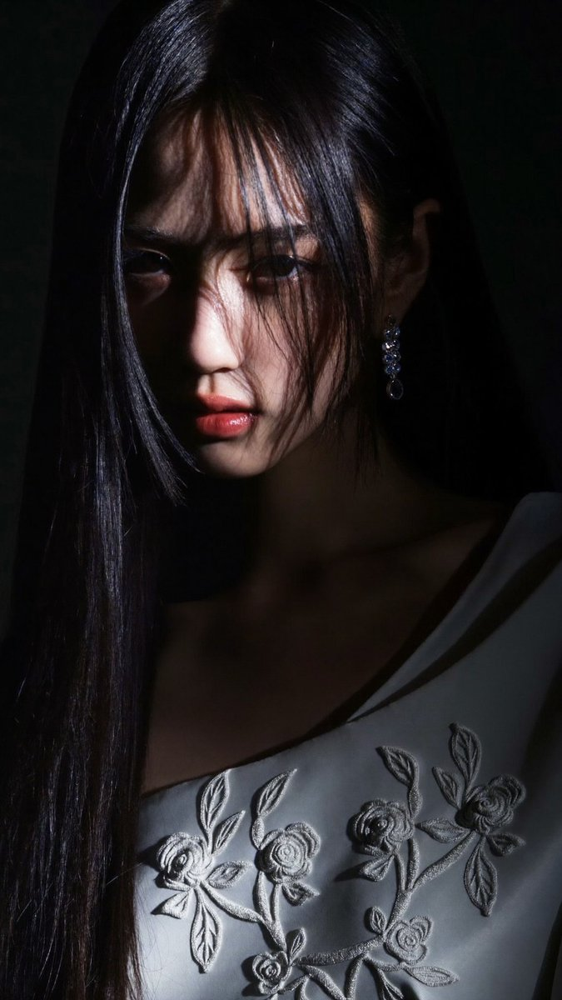

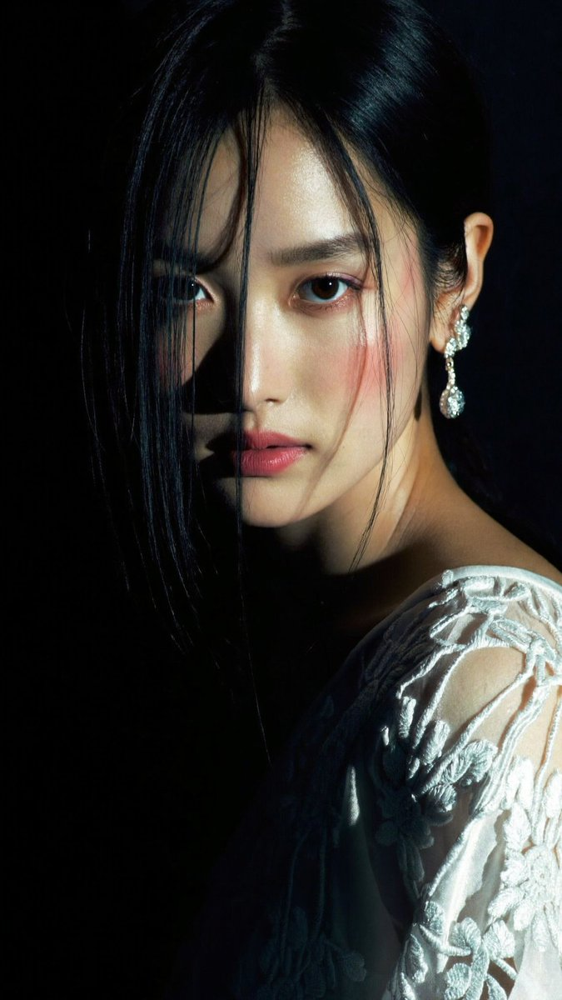

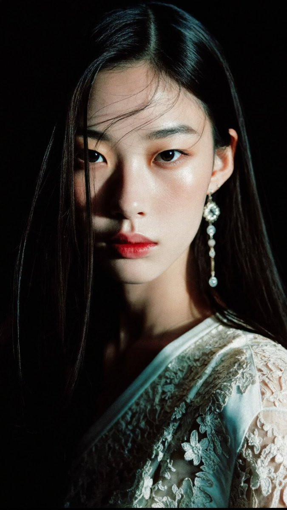

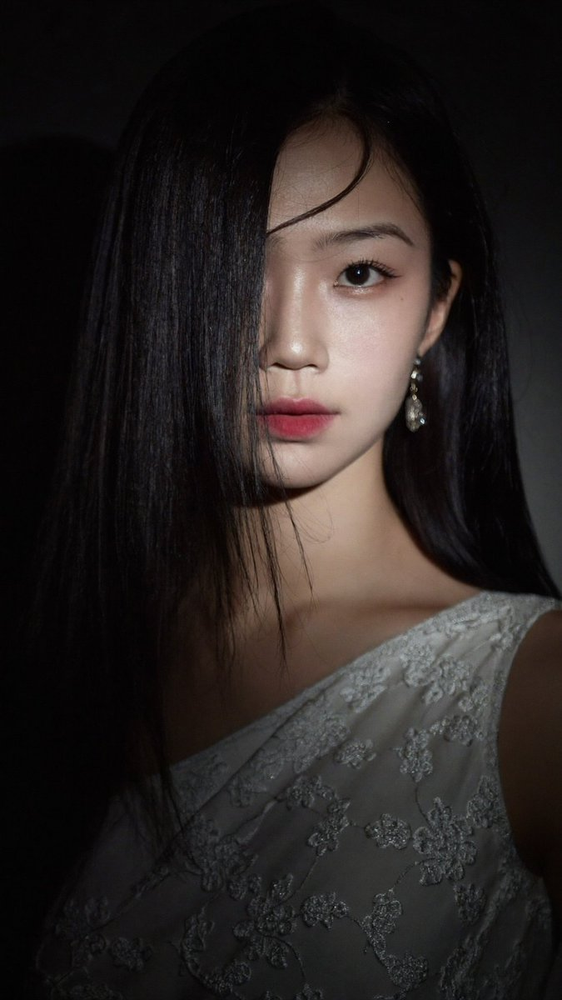

**Consigne**

```text
Un portrait cinématographique en gros plan d'une jeune femme est-asiatique à la peau de porcelaine pâle et aux longs cheveux noirs, raides et brillants tombant sur le côté gauche de son visage, plusieurs mèches couvrant partiellement son œil gauche. Elle regarde directement l'objectif avec une expression calme et légèrement mystérieuse. Lèvres rouge-rose doux, sourcils sombres bien dessinés, maquillage subtil. Elle porte un élégant vêtement asymétrique en satin ou en soie blanche orné de délicats motifs de dentelle florale brodée qui captent la lumière. Une longue boucle d'oreille pendante en cristal ou ornée de bijoux est suspendue à son oreille droite visible.

Éclairage dramatique à fort contraste (clair-obscur / style Rembrandt) : une source de lumière directionnelle unique venant de la gauche illumine le côté droit de son visage, la courbe de sa joue, ses lèvres et le lustre de ses cheveux, tandis que le reste de son visage et tout l'arrière-plan tombent dans une ombre noire, profonde et veloutée. Arrière-plan sombre, presque noir obsidienne, sans aucun détail visible. Atmosphère envoûtante, élégante et intime. Photoréaliste, texture de peau ultra-détaillée, mèches de cheveux individuelles, éclat du tissu et broderie, étalonnage des couleurs cinématographique avec des ombres froides et des reflets chauds sur la peau.

Mots-clés de style : dark academia portrait, high-fashion editorial photography, low-key lighting, shallow depth of field, 85mm lens look, masterpiece, 8k, highly detailed.
```

[↑ Retour aux catégories](#catalog)

---

<a name="category-anime-manga"></a>

## Anime / Manga

<a name="prompt-2098385016896336030"></a>

### Une scène d'action dynamique dans le style anime d'ufotable dépeignant deux sœurs déesses chinoises vêtues de qipaos fendus endommagés par le combat, se livrant un duel à mort au milieu de flammes bleues et rouges.

Auteur：[@asgam1ngx](https://x.com/asgam1ngx) · [Publication originale](https://x.com/asgam1ngx/status/2098385016896336030)

Bande dessinée / Storyboard · Anime / Manga · Publié

**Résumé:** Une scène d'action dynamique dans le style anime d'ufotable dépeignant deux sœurs déesses chinoises vêtues de qipaos fendus endommagés par le combat, se livrant un duel à mort au milieu de flammes bleues et rouges.

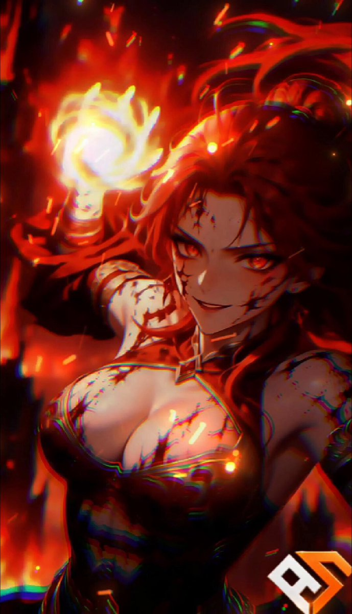

**Consigne**

```text
chef-d'œuvre anime, plan d'action dynamique, 2 sœurs déesses chinoises, corps voluptueux et tout en courbes, qipao cheongsam en soie à fente haute, vêtements endommagés par le combat, éclaboussures de sang, yeux brillants, éclairage cinématographique, ombres dramatiques, style ufotable, 8k --ar 9:16 --v 6.0
```

[↑ Retour aux catégories](#catalog)

---

<a name="category-illustration"></a>

## Illustration

<a name="prompt-2098456570678149630"></a>

### Prompt d'illustration sur le thème de septembre utilisant des références de style Midjourney.

Auteur：[@airina\_xyz](https://x.com/airina_xyz) · [Publication originale](https://x.com/airina_xyz/status/2098456570678149630)

Illustration · Publié

**Résumé:** Prompt d'illustration sur le thème de septembre utilisant des références de style Midjourney.

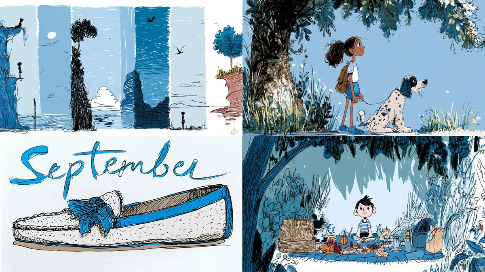

**Consigne**

```text
Septembre --ar 16:9 --sref 153692563 1979431158 2653758855
```

[↑ Retour aux catégories](#catalog)

---

<a name="category-other"></a>

## Autres

<a name="prompt-2097086370301042925"></a>

### Concept de personnage de sorcier du maïs mêlant les styles de Merlin et de l'apprenti avec un arrière-plan de maïs.

Auteur：[@teedubya](https://x.com/teedubya) · [Publication originale](https://x.com/teedubya/status/2097086370301042925)

Personnage · Résumé / Contexte · Publié

**Résumé:** Concept de personnage de sorcier du maïs mêlant les styles de Merlin et de l'apprenti avec un arrière-plan de maïs.

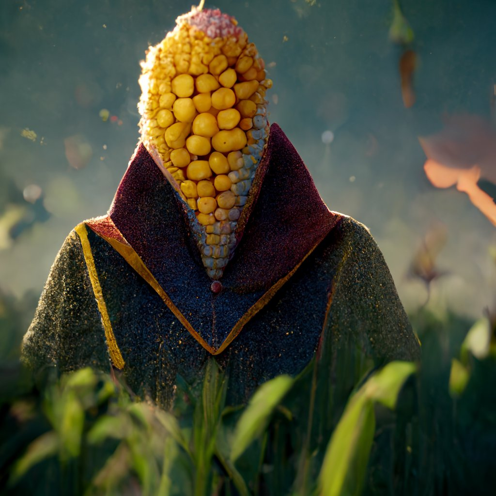

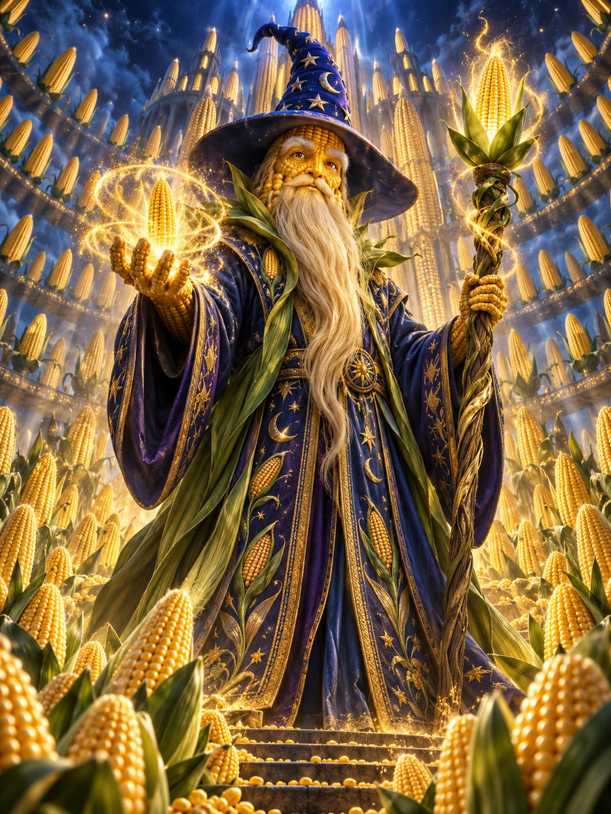

**Consigne**

```text
le sorcier du maïs. L'Apprenti de Disney rencontre Merlin l'enchanteur. Beaucoup de travail. Unreal Engine. 8k. Mystérieux, magnanime, un maximum d'épis de maïs derrière l'homme sorcier du maïs au centre de l'image emblématique
```

[↑ Retour aux catégories](#catalog)

---

<a name="prompt-2096629184512610370"></a>

### Une pensée visualisée sous la forme d'un délicat organisme transparent doté d'une lumière ambrée incandescente et de fins filaments d'argent se déployant dans une chambre noire.

Auteur：[@Ror\_Fly](https://x.com/Ror_Fly) · [Publication originale](https://x.com/Ror_Fly/status/2096629184512610370)

Animal / Créature · Publié

**Résumé:** Une pensée visualisée sous la forme d'un délicat organisme transparent doté d'une lumière ambrée incandescente et de fins filaments d'argent se déployant dans une chambre noire.

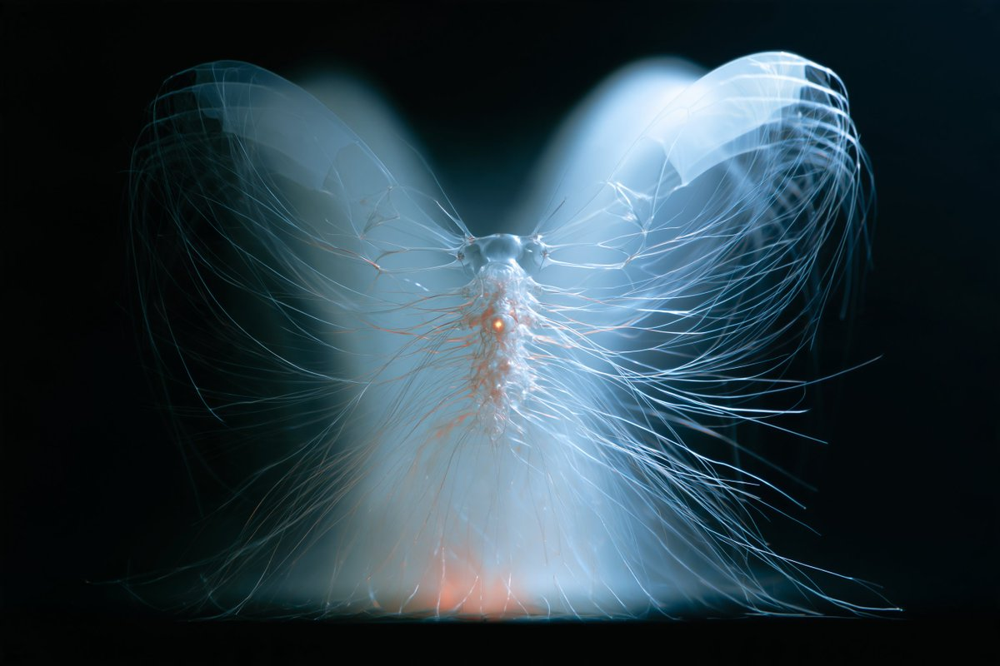

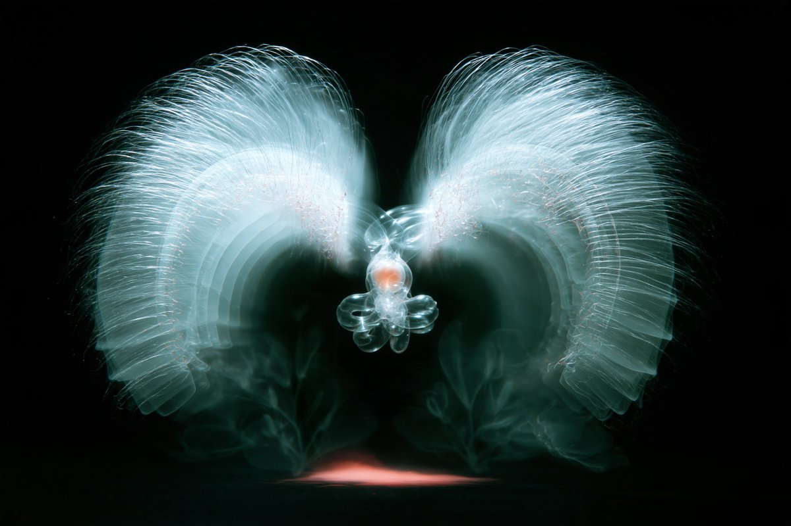

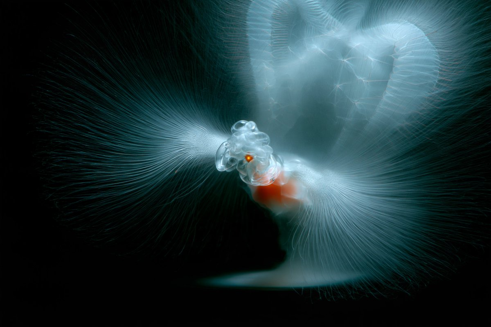

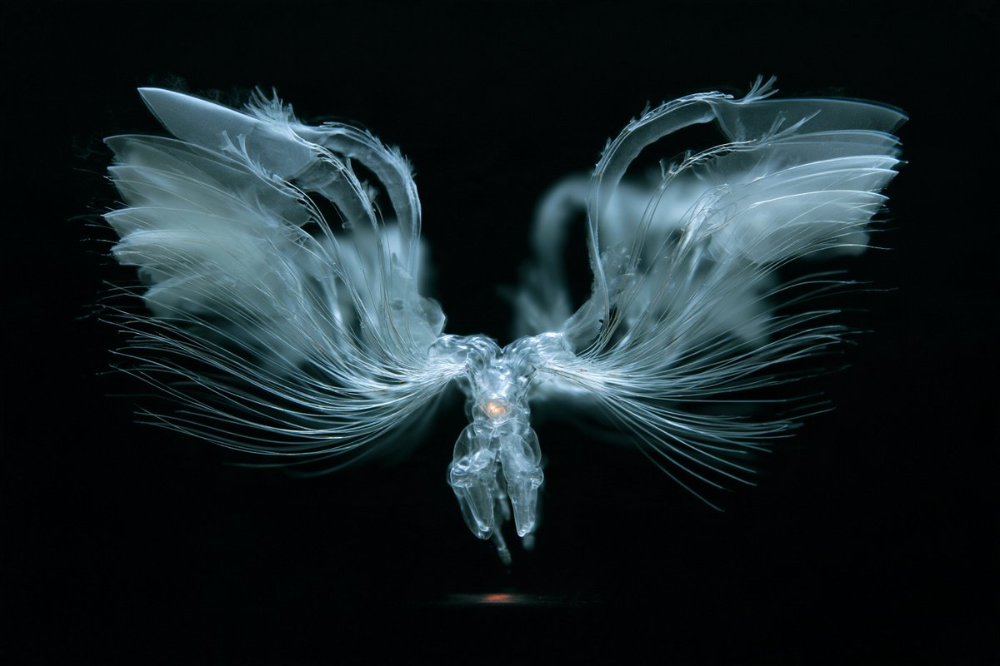

**Consigne**

```text
Une pensée avant qu'elle ne devienne une phrase. Un petit organisme transparent suspendu au centre d'une immense chambre noire inachevée, son corps un nœud complexe de capillaires clairs abritant une unique lumière ambrée chaude. Des milliers de filaments d'argent fins comme des cheveux s'en déploient comme les branchies d'un papillon de verre, se ramifiant vers l'extérieur en arches à demi formées, en pages translucides pliées et en pâles géométries botaniques ; la plupart se dissolvent dans l'obscurité avant de devenir des objets. Les fils les plus proches sont douloureusement nets, la structure lointaine à peine suggérée. Une minuscule flaque de lumière chaude sous la créature, un vaste espace négatif bleu froid au-dessus. Poussière de porcelaine, délicat maillage de silice, subtils contacts de cuivre, une structure prise sur le fait de s'assembler elle-même. Photomicrographie sur fond noir avec l'échelle impossible de la photographie d'architecture, rétrodiffusion volumétrique, bords réfractifs exquis, cyan discret, ivoire et braise orange. Fragile, provisoire, intensément attentif. --chaos 28 --ar 3:2 --profile mc9ebw2 hkb2ane qpfs1tj 2nqm1xw --stylize 800 --hd
```

[↑ Retour aux catégories](#catalog)

---

[Explorer Leadde.ai →](https://leadde.ai/?utm_source=github&utm_medium=readme&utm_campaign=prompt-library&utm_content=midjourney)
