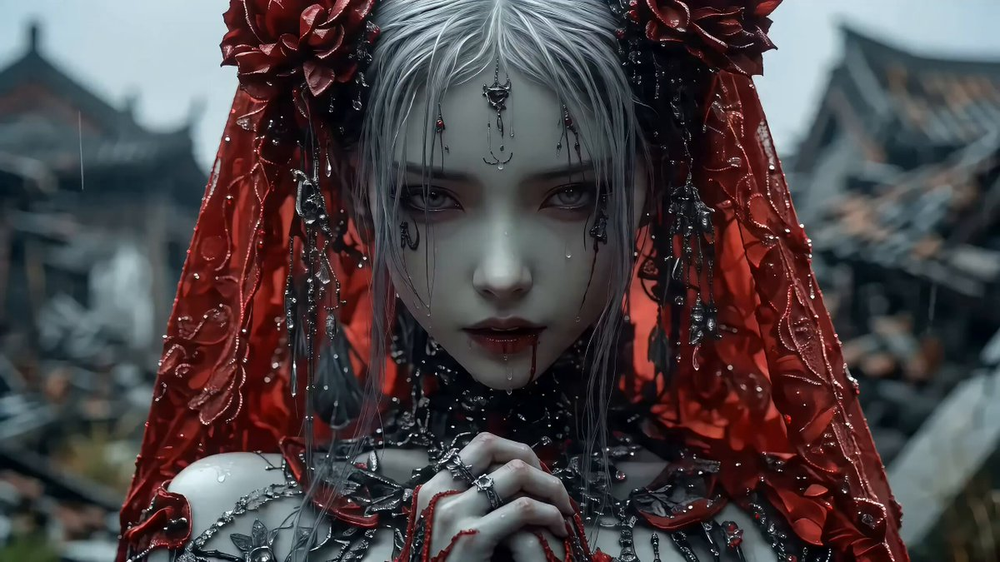
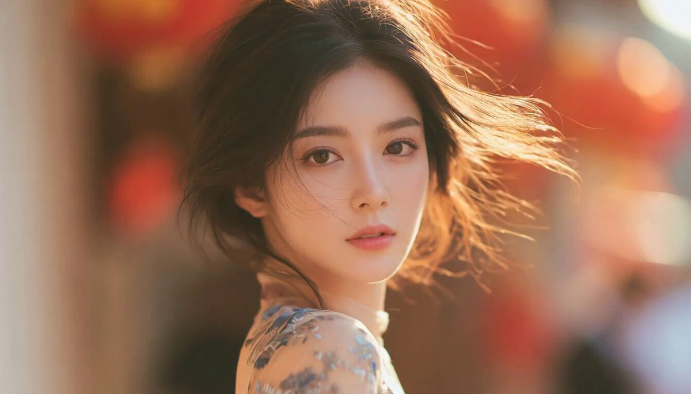
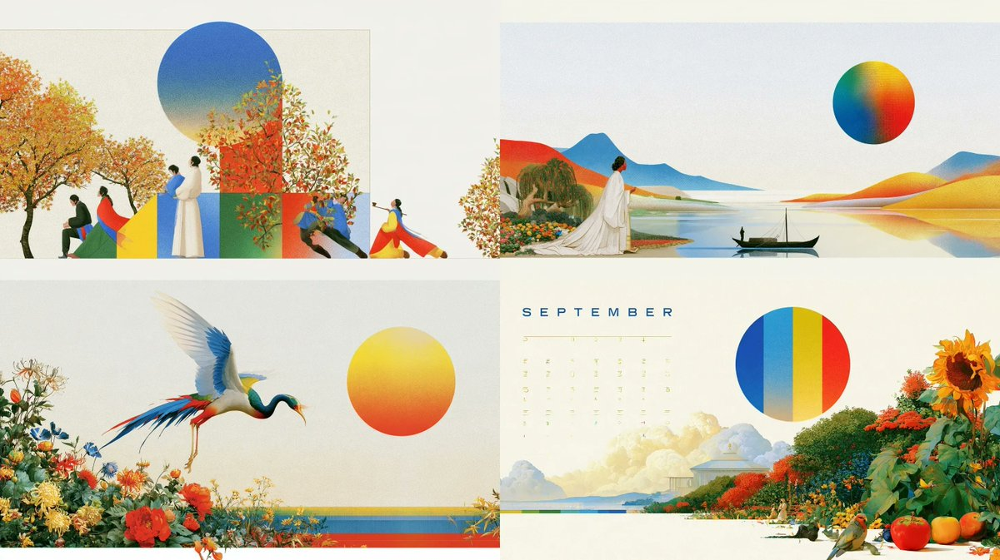
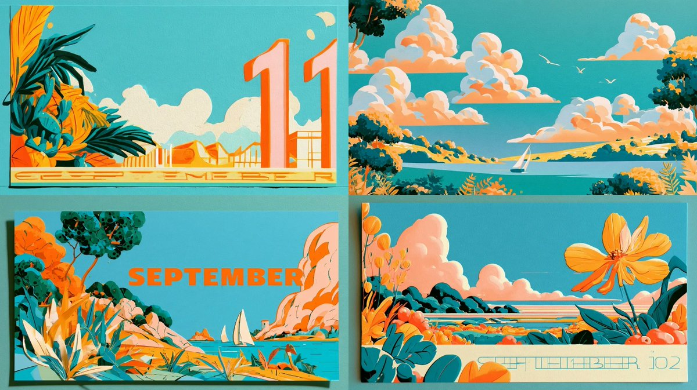
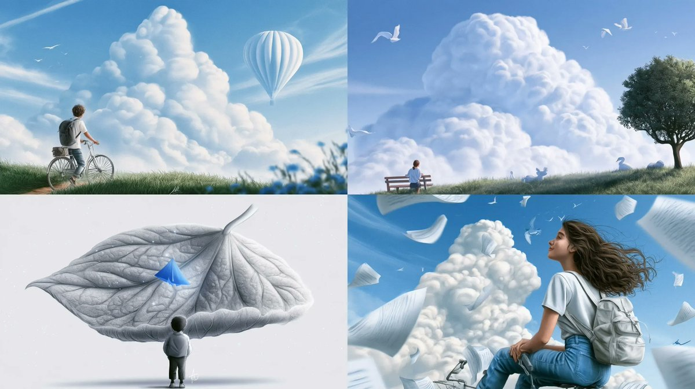
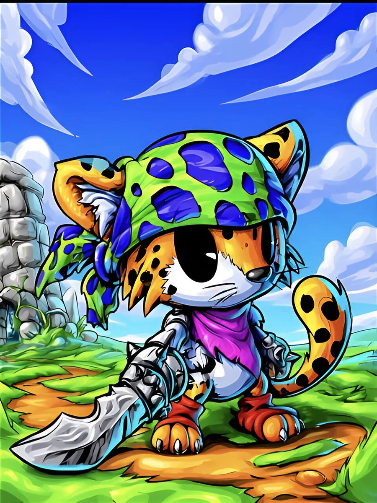
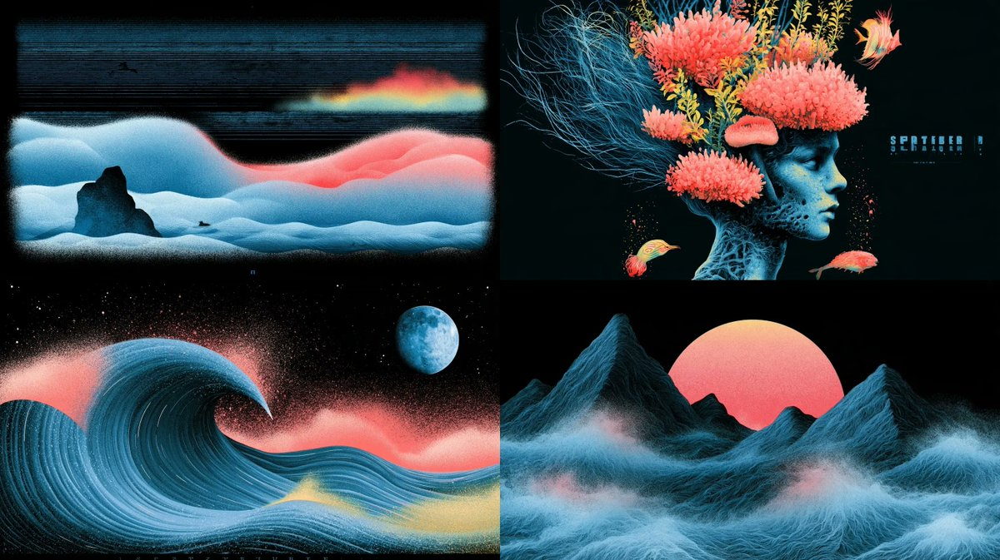
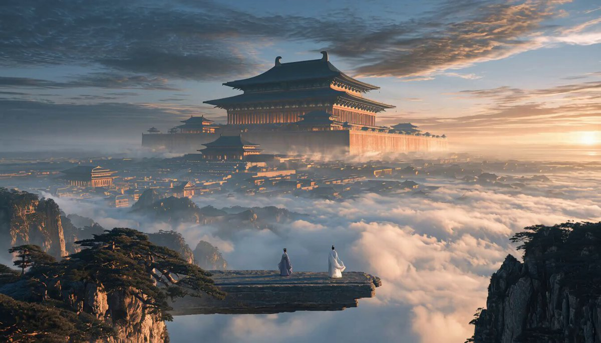

# Midjourney · Raccolta di prompt · Leadde.ai

[](README.md) [](README_zh.md) [](README_zh-TW.md) [](README_ja-JP.md) [](README_ko-KR.md) [](README_th-TH.md) [](README_vi-VN.md) [](README_hi-IN.md) [](README_es-ES.md) [-lightgrey)](README_es-419.md) [](README_de-DE.md) [](README_fr-FR.md) [](README_it-IT.md) [-lightgrey)](README_pt-BR.md) [](README_pt-PT.md) [](README_tr-TR.md)

**Best for:** Midjourney prompts for art direction, campaign keyframes, concept development, and visual styles.

For PDF, PPT, SOP, training, and multilingual video workflows:
[Awesome Document-to-Video](https://github.com/LeaddeOpenLab/awesome-document-to-video)

> **Prompt di qualità selezionati ogni giorno**

Scopri prompt completi per immagini, video e creazioni 3D con l’IA. Esplora gli stili, le versioni multilingue e le fonti degli autori originali.

[Esplora Leadde.ai →](https://leadde.ai/?utm_source=github&utm_medium=readme&utm_campaign=prompt-library&utm_content=midjourney)

## Scopri Leadde.ai

Leadde.ai aiuta i team a trasformare documenti, diapositive e testi in video aziendali con l’IA per formazione, inserimento del personale e marketing.

Aggiungi una stella a questo repository per seguire i prompt selezionati ogni giorno e trovare nuove idee creative.

**15** Prompt · Ultima aggiunta: **2026-09-18**

<a name="catalog"></a>

## Sfoglia per categoria

[Fotografia](#category-photography) · [Fermo immagine cinematografico / Still fotografico](#category-cinematic-film-still) · [Anime / Manga](#category-anime-manga) · [Illustrazione](#category-illustration) · [Fumetto / Graphic Novel](#category-comic-graphic-novel) · [Altro](#category-other)

<a name="all-prompts"></a>

<a name="category-photography"></a>

## Fotografia

<a name="prompt-2098364624613802381"></a>

### La protagonista si volta sorridendo sotto un pero e poi gira timidamente il capo, accompagnata da petali nel vento e da vesti e capelli che fluttuano.

Autore：[@PixelAigc](https://x.com/PixelAigc) · [Post originale](https://x.com/PixelAigc/status/2098364624613802381)

Fotografia · Pubblicato

Post originale：[@PixelAigc](https://x.com/PixelAigc) · [Post originale](https://x.com/PixelAigc/status/2098321856168398953)

**Riepilogo:** La protagonista si volta sorridendo sotto un pero e poi gira timidamente il capo, accompagnata da petali nel vento e da vesti e capelli che fluttuano.


**Prompt**

```text
La protagonista gira la testa verso la telecamera, sorride dolcemente e poi si volta di nuovo con timidezza; soffia il vento, i fiori di pero volteggiano nell'aria, capelli e vestiti fluttuano
```

[↑ Torna alle categorie](#catalog)

---

<a name="category-cinematic-film-still"></a>

## Fermo immagine cinematografico / Still fotografico

<a name="prompt-2099327675244720565"></a>

### Storyboard in stile dark gothic di 15 secondi: una donna orientale in un abito da sposa rosso strappato piange, ride e crolla a terra disperata tra le rovine di un antico edificio sotto una leggera pioggia.

Autore：[@liluocheng13](https://x.com/liluocheng13) · [Post originale](https://x.com/liluocheng13/status/2099327675244720565)

Fumetto / Storyboard · Fermo immagine cinematografico / Still fotografico · Architettura / Interni · Pubblicato

**Riepilogo:** Storyboard in stile dark gothic di 15 secondi: una donna orientale in un abito da sposa rosso strappato piange, ride e crolla a terra disperata tra le rovine di un antico edificio sotto una leggera pioggia.



**Prompt**

```text
Soggetto principale: Una donna orientale dalla bellezza inquietante con un abito da sposa cremisi a brandelli e un velo rosso, i suoi capelli argentei spettinati. Lo sfondo è costituito dalle rovine di un antico edificio cinese crollato, sotto un cielo grigio con una leggera pioggia che cade.
Storyboard narrativo (0–15 secondi):
0–5s — Primo piano e tormento: La telecamera si avvicina lentamente al volto della donna in primo piano. I suoi occhi sono persi nel vuoto, le lacrime si mescolano alla pioggia scivolando lungo le guance, eppure un sorriso inquietante aleggia all'angolo della bocca — la sua espressione è contorta tra angoscia e follia.
5–10s — Inciampo e frantumazione: La telecamera segue i suoi passi mentre incespica insicura tra le rovine, con l'orlo del suo abito da sposa che sfiora macerie e rami secchi con un fruscio sommesso.
10–15s — Disperazione e rovina: L'inquadratura a grandangolo si allontana mentre lei crolla a terra seduta tra le rovine, con il velo rosso che scivola via rivelando il suo viso pallido. Reclina la testa all'indietro verso il cielo grigio, la sua risata si spegne mentre le lacrime continuano a scorrere.
Stile e atmosfera: Qualità cinematografica, stile gotico oscuro, contrasto elevato, impatto visivo sorprendente in rosso e nero, oppressivo, disperato, surrealista, risoluzione 8K, dettagli squisiti.
Negativo: Low quality, stutter, face/body collapse, over-bright, excessive gore, stiff motion, watermark, T-pose, bright palette, flashy VFX, rigid camera, lack of speed/blur, weak kills.
```

[↑ Torna alle categorie](#catalog)

---

<a name="prompt-2099114753662861645"></a>

### Traduzione in corso

Autore：[@PixelAigc](https://x.com/PixelAigc) · [Post originale](https://x.com/PixelAigc/status/2099114753662861645)

Fermo immagine cinematografico / Still fotografico · Personaggio · Pubblicato

**Riepilogo:** Traduzione in corso



**Prompt**

```text
Traduzione in corso
```

[↑ Torna alle categorie](#catalog)

---

<a name="prompt-2098392368487485484"></a>

### Ritratto cinematografico di una donna dell'Asia orientale con illuminazione in chiaroscuro ad alto contrasto e abito in seta bianca ricamata.

Autore：[@woleswoosh](https://x.com/woleswoosh) · [Post originale](https://x.com/woleswoosh/status/2098392368487485484)

Fermo immagine cinematografico / Still fotografico · Ritratto / Selfie · Personaggio · Articolo di moda · Pubblicato

**Riepilogo:** Ritratto cinematografico di una donna dell'Asia orientale con illuminazione in chiaroscuro ad alto contrasto e abito in seta bianca ricamata.


**Prompt**

```text
Un ritratto cinematografico in primo piano di una giovane donna dell'Asia orientale con pelle pallida di porcellana e lunghi capelli neri lisci e lucidi che le ricadono sul lato sinistro del viso, con diverse ciocche che le coprono parzialmente l'occhio sinistro. Guarda direttamente verso l'obiettivo con un'espressione calma e leggermente misteriosa. Labbra morbide di colore rosso-rosato, sopracciglia scure e definite, trucco sobrio. Indossa un elegante capo monospalla in raso o seta bianca con delicati ricami floreali in pizzo che catturano la luce. Un lungo orecchino pendente di cristallo o gioiello pende dal suo orecchio destro visibile.

Illuminazione drammatica ad alto contrasto (chiaroscuro / stile Rembrandt): un'unica sorgente luminosa direzionale da sinistra illumina il lato destro del viso, la curva della guancia, le labbra e la lucentezza dei capelli, mentre il resto del viso e l'intero sfondo sprofondano in un'ombra nera profonda e vellutata. Sfondo scuro, quasi nero ossidiana, senza dettagli visibili. Atmosfera suggestiva, elegante e intima. Fotorealistico, texture della pelle ultra-dettagliata, singole ciocche di capelli, lucentezza del tessuto e ricami, color grading cinematografico con ombre fredde e riflessi caldi sulla pelle.

Parole chiave di stile: dark academia portrait, high-fashion editorial photography, low-key lighting, shallow depth of field, 85mm lens look, masterpiece, 8k, highly detailed.
```

[↑ Torna alle categorie](#catalog)

---

<a name="category-anime-manga"></a>

## Anime / Manga

<a name="prompt-2098818944673182032"></a>

### Generare un'illustrazione anime di inizio autunno con &quot;September&quot; come parola chiave combinata con codici di riferimento di stile.

Autore：[@airina\_xyz](https://x.com/airina_xyz) · [Post originale](https://x.com/airina_xyz/status/2098818944673182032)

Anime / Manga · Illustrazione · Pubblicato

**Riepilogo:** Generare un'illustrazione anime di inizio autunno con &quot;September&quot; come parola chiave combinata con codici di riferimento di stile.


**Prompt**

```text
Settembre --ar 16:9 --sref 1674635905 980814165 1931977838
```

[↑ Torna alle categorie](#catalog)

---

<a name="prompt-2098385016896336030"></a>

### Una scena d'azione dinamica nello stile anime di ufotable che ritrae due sorelle dee cinesi vestite con qipao dallo spacco alto danneggiati dalla battaglia in un combattimento all'ultimo sangue tra fiamme blu e rosse.

Autore：[@asgam1ngx](https://x.com/asgam1ngx) · [Post originale](https://x.com/asgam1ngx/status/2098385016896336030)

Fumetto / Storyboard · Anime / Manga · Pubblicato

**Riepilogo:** Una scena d'azione dinamica nello stile anime di ufotable che ritrae due sorelle dee cinesi vestite con qipao dallo spacco alto danneggiati dalla battaglia in un combattimento all'ultimo sangue tra fiamme blu e rosse.


**Prompt**

```text
capolavoro anime, inquadratura d'azione dinamica, 2 sorelle dee cinesi, corpo voluttuoso e formoso, qipao cheongsam di seta con spacco alto, abiti danneggiati dalla battaglia, schizzi di sangue, occhi luminosi, illuminazione cinematografica, ombre drammatiche, stile ufotable, 8k --ar 9:16 --v 6.0
```

[↑ Torna alle categorie](#catalog)

---

<a name="category-illustration"></a>

## Illustrazione

<a name="prompt-2100269243774435679"></a>

### Prompt di illustrazione Midjourney a tema settembre con riferimenti di stile.

Autore：[@airina\_xyz](https://x.com/airina_xyz) · [Post originale](https://x.com/airina_xyz/status/2100269243774435679)

Illustrazione · Pubblicato

**Riepilogo:** Prompt di illustrazione Midjourney a tema settembre con riferimenti di stile.



**Prompt**

```text
Settembre --ar 16:9 --sref 1095039279 3527724752 2108669540
```

[↑ Torna alle categorie](#catalog)

---

<a name="prompt-2099543459707392043"></a>

### Settembre --ar 16:9 --sref 3063123838 538684311 4236559069

Autore：[@airina\_xyz](https://x.com/airina_xyz) · [Post originale](https://x.com/airina_xyz/status/2099543459707392043)

Illustrazione · Pubblicato

**Riepilogo:** Settembre --ar 16:9 --sref 3063123838 538684311 4236559069



**Prompt**

```text
Settembre --ar 16:9 --sref 3063123838 538684311 4236559069
```

[↑ Torna alle categorie](#catalog)

---

<a name="prompt-2099188369188372625"></a>

### Scena di illustrazione surrealista generata con il tema &quot;Settembre&quot; combinato con codici di riferimento di stile specifici.

Autore：[@airina\_xyz](https://x.com/airina_xyz) · [Post originale](https://x.com/airina_xyz/status/2099188369188372625)

Illustrazione · Pubblicato

**Riepilogo:** Scena di illustrazione surrealista generata con il tema &quot;Settembre&quot; combinato con codici di riferimento di stile specifici.



**Prompt**

```text
Settembre --ar 16:9 --sref 1750398336 2622495067 588281222
```

[↑ Torna alle categorie](#catalog)

---

<a name="prompt-2098456570678149630"></a>

### Prompt di illustrazione a tema settembre che utilizza riferimenti di stile Midjourney.

Autore：[@airina\_xyz](https://x.com/airina_xyz) · [Post originale](https://x.com/airina_xyz/status/2098456570678149630)

Illustrazione · Pubblicato

**Riepilogo:** Prompt di illustrazione a tema settembre che utilizza riferimenti di stile Midjourney.


**Prompt**

```text
Settembre --ar 16:9 --sref 153692563 1979431158 2653758855
```

[↑ Torna alle categorie](#catalog)

---

<a name="category-comic-graphic-novel"></a>

## Fumetto / Graphic Novel

<a name="prompt-2100931328422396328"></a>

### Traduzione in corso

Autore：[@iX00AI2](https://x.com/iX00AI2) · [Post originale](https://x.com/iX00AI2/status/2100931328422396328)

Fumetto / Graphic Novel · Personaggio · Pubblicato

Post originale：[@SREFCLUB](https://x.com/SREFCLUB) · [Post originale](https://x.com/SREFCLUB/status/2100890349929464237)

**Riepilogo:** Traduzione in corso



**Prompt**

```text
Traduzione in corso
```

[↑ Torna alle categorie](#catalog)

---

<a name="category-other"></a>

## Altro

<a name="prompt-2100630123099930945"></a>

### Prompt Midjourney a tema settembre con ID di riferimento di stile.

Autore：[@airina\_xyz](https://x.com/airina_xyz) · [Post originale](https://x.com/airina_xyz/status/2100630123099930945)

Altro · Pubblicato

**Riepilogo:** Prompt Midjourney a tema settembre con ID di riferimento di stile.



**Prompt**

```text
Settembre --ar 16:9 --sref 1603183707 2430795563 3477797524
```

[↑ Torna alle categorie](#catalog)

---

<a name="prompt-2099521272413909034"></a>

### Prompt in piano sequenza continuo di una balena gigante particellare che salta davanti a un palazzo celeste nel mare di nuvole con movimento di camera e primo piano del palazzo.

Autore：[@PixelAigc](https://x.com/PixelAigc) · [Post originale](https://x.com/PixelAigc/status/2099521272413909034)

Altro · Pubblicato

**Riepilogo:** Prompt in piano sequenza continuo di una balena gigante particellare che salta davanti a un palazzo celeste nel mare di nuvole con movimento di camera e primo piano del palazzo.



**Prompt**

```text
Piano sequenza continuo, la telecamera avanza, la telecamera compie una rotazione orbitale, soffia il vento, i vestiti fluttuano, nubi e nebbia si agitano vorticosamente, una gigantesca balena con effetto particellare balza fuori dalla nebbia per poi reimmergersi nel mare di nuvole, la telecamera sfiora la balena e infine si fissa su un primo piano del palazzo
```

[↑ Torna alle categorie](#catalog)

---

<a name="prompt-2097086370301042925"></a>

### Concept per il personaggio del mago del mais che fonde lo stile di Merlino e dell'apprendista con uno sfondo di mais.

Autore：[@teedubya](https://x.com/teedubya) · [Post originale](https://x.com/teedubya/status/2097086370301042925)

Personaggio · Abstract / Contesto · Pubblicato

**Riepilogo:** Concept per il personaggio del mago del mais che fonde lo stile di Merlino e dell'apprendista con uno sfondo di mais.


**Prompt**

```text
il mago del mais. L'apprendista Disney incontra Mago Merlino. Molto lavoro. Unreal Engine. 8k. Misterioso, magnanimo, il massimo delle spighe di mais dietro l'uomo mago del mais al centro dell'immagine iconica
```

[↑ Torna alle categorie](#catalog)

---

<a name="prompt-2096629184512610370"></a>

### Un pensiero visualizzato come un delicato organismo trasparente con una calda luce ambrata e sottili filamenti d'argento che si dispiegano in una camera oscura.

Autore：[@Ror\_Fly](https://x.com/Ror_Fly) · [Post originale](https://x.com/Ror_Fly/status/2096629184512610370)

Animale / Creatura · Pubblicato

**Riepilogo:** Un pensiero visualizzato come un delicato organismo trasparente con una calda luce ambrata e sottili filamenti d'argento che si dispiegano in una camera oscura.


**Prompt**

```text
Un pensiero prima di diventare una frase. Un piccolo organismo trasparente sospeso al centro di un'immensa camera oscura incompiuta, il suo corpo un intricato nodo di capillari limpidi che racchiudono una singola calda luce ambrata. Migliaia di filamenti d'argento sottili come capelli si dispiegano da esso come le branchie di una falena di vetro, ramificandosi verso l'esterno in archi semiformati, pagine traslucide piegate e tenui geometrie botaniche; la maggior parte si dissolve nell'oscurità prima di diventare oggetti. I fili più vicini sono dolorosamente nitidi, la struttura distante appena suggerita. Una minuscola pozza di luce calda sotto la creatura, un vasto spazio negativo blu freddo sopra. Polvere di porcellana, delicata maglia di silice, sottili contatti di rame, una struttura colta nell'atto di autoassemblarsi. Fotomicrografia in campo scuro con la scala impossibile della fotografia architettonica, retrodiffusione volumetrica, squisiti bordi rifrangenti, ciano sobrio, avorio e arancione brace. Fragile, provvisorio, intensamente attento. --chaos 28 --ar 3:2 --profile mc9ebw2 hkb2ane qpfs1tj 2nqm1xw --stylize 800 --hd
```

[↑ Torna alle categorie](#catalog)

---

[Esplora Leadde.ai →](https://leadde.ai/?utm_source=github&utm_medium=readme&utm_campaign=prompt-library&utm_content=midjourney)
