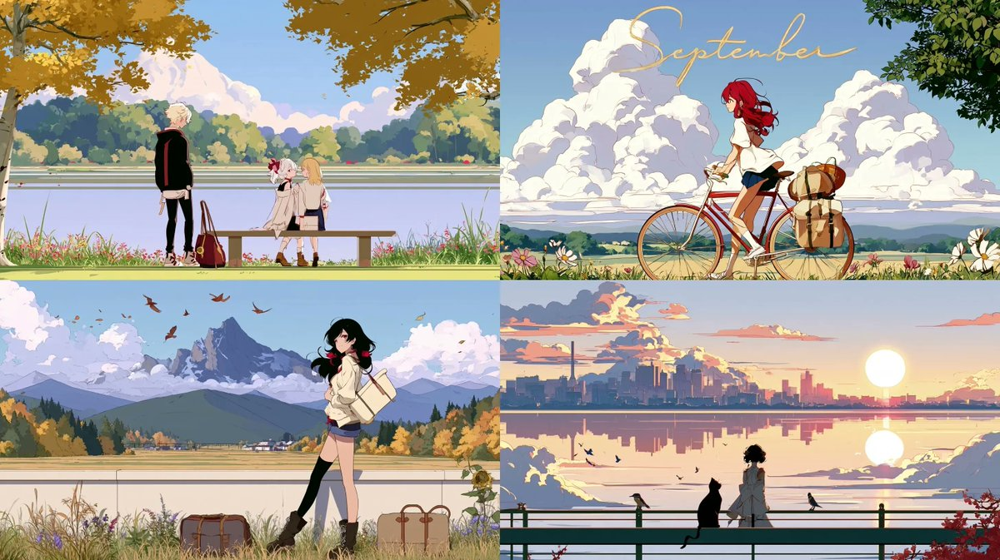

# Midjourney · Prompt 資料庫 · Leadde.ai

[](README.md) [](README_zh.md) [](README_zh-TW.md) [](README_ja-JP.md) [](README_ko-KR.md) [](README_th-TH.md) [](README_vi-VN.md) [](README_hi-IN.md) [](README_es-ES.md) [-lightgrey)](README_es-419.md) [](README_de-DE.md) [](README_fr-FR.md) [](README_it-IT.md) [-lightgrey)](README_pt-BR.md) [](README_pt-PT.md) [](README_tr-TR.md)

**Best for:** Midjourney prompts for art direction, campaign keyframes, concept development, and visual styles.

For PDF, PPT, SOP, training, and multilingual video workflows:
[Awesome Document-to-Video](https://github.com/LeaddeOpenLab/awesome-document-to-video)

> **每日更新，精選高品質提示詞**

探索用於 AI 圖像、影片與 3D 創作的完整提示詞。依風格瀏覽、切換多語言版本，查看原作者與作品來源。

[探索 Leadde.ai →](https://leadde.ai/?utm_source=github&utm_medium=readme&utm_campaign=prompt-library&utm_content=midjourney)

## 認識 Leadde.ai

Leadde.ai 協助團隊將文件、簡報和文字轉換為 AI 商業影片，適用於培訓、員工入職與行銷。

為儲存庫加上 Star，追蹤每日精選提示詞，持續獲得創作靈感。

**7** 筆內容 · 最新收錄: **2026-09-12**

<a name="catalog"></a>

## 分類目錄

[攝影](#category-photography) · [電影感 / 電影劇照](#category-cinematic-film-still) · [動畫 / 漫畫](#category-anime-manga) · [插圖](#category-illustration) · [其他](#category-other)

<a name="all-prompts"></a>

<a name="category-photography"></a>

## 攝影

<a name="prompt-2098364624613802381"></a>

### 女主角在梨花樹下微笑回眸並嬌羞轉頭，伴隨風吹花瓣與衣髮飄動。

作者：[@PixelAigc](https://x.com/PixelAigc) · [查看 X 原帖](https://x.com/PixelAigc/status/2098364624613802381)

攝影 · 已推流

查看 X 原帖：[@PixelAigc](https://x.com/PixelAigc) · [查看 X 原帖](https://x.com/PixelAigc/status/2098321856168398953)

**概括:** 女主角在梨花樹下微笑回眸並嬌羞轉頭，伴隨風吹花瓣與衣髮飄動。


**提示詞**

```text
女主角轉頭看向鏡頭，微微一笑，又嬌羞地轉過去，風吹過來，梨花飄揚，頭髮和衣服飄揚
```

[↑ 返回分類目錄](#catalog)

---

<a name="category-cinematic-film-still"></a>

## 電影感 / 電影劇照

<a name="prompt-2098392368487485484"></a>

### 高對比度明暗布光與刺繡白絲綢長裙的東亞女性電影質感肖像。

作者：[@woleswoosh](https://x.com/woleswoosh) · [查看 X 原帖](https://x.com/woleswoosh/status/2098392368487485484)

電影感 / 電影劇照 · 人像 / 自拍 · 角色 · 時尚單品 · 已推流

**概括:** 高對比度明暗布光與刺繡白絲綢長裙的東亞女性電影質感肖像。


**提示詞**

```text
一位年輕東亞女性的電影質感特寫肖像，她擁有蒼白如瓷的肌膚，烏黑柔順且富有光澤的長髮垂落在臉頰左側，幾縷髮絲微遮住她的左眼。她以平靜而微帶神秘的目光直視鏡頭。雙唇呈現柔和的粉紅色，眉毛濃密精緻，妝容細膩淡雅。她身穿一件優雅的白色緞面或真絲單肩服飾，其上繡有精緻的蕾絲花卉刺繡，在光線下一閃一閃。露出的右耳戴著一只長款搖曳的水晶或寶石耳墜。

戲劇性的高對比光影（明暗對比法 / 倫勃朗式布光）：來自左側的單一定向光源照亮了她臉龐的右側、面頰輪廓、嘴唇以及秀髮的光澤，而面部其餘部分和整個背景則隱沒於深邃的天鵝絨般黑色陰影中。近乎曜石般的漆黑背景，毫無可見細節。氛圍憂鬱、高雅而私密。逼真的照片質感，超精細的皮膚紋理，根根分明的髮絲，面料的光澤與刺繡細節，電影般的色彩調性，陰影偏冷調，肌膚高光處帶有一抹暖意。

風格關鍵字：暗黑學院風肖像，高端時尚雜誌攝影，低調布光，淺景深，85mm鏡頭感，傑作，8k，極致細節。
```

[↑ 返回分類目錄](#catalog)

---

<a name="category-anime-manga"></a>

## 動畫 / 漫畫

<a name="prompt-2098818944673182032"></a>

### 翻譯中

作者：[@airina\_xyz](https://x.com/airina_xyz) · [查看 X 原帖](https://x.com/airina_xyz/status/2098818944673182032)

動畫 / 漫畫 · 插圖 · 已推流

**概括:** 翻譯中



**提示詞**

```text
翻譯中
```

[↑ 返回分類目錄](#catalog)

---

<a name="prompt-2098385016896336030"></a>

### 以 ufotable 動漫風格描繪兩位身穿戰損高衩旗袍的中國女神姊妹在藍紅烈焰中死鬥的動態動作場景。

作者：[@asgam1ngx](https://x.com/asgam1ngx) · [查看 X 原帖](https://x.com/asgam1ngx/status/2098385016896336030)

漫畫 / 分鏡腳本 · 動畫 / 漫畫 · 已推流

**概括:** 以 ufotable 動漫風格描繪兩位身穿戰損高衩旗袍的中國女神姊妹在藍紅烈焰中死鬥的動態動作場景。


**提示詞**

```text
動漫傑作，動態動作鏡頭，2位中國女神姊妹，性感曼妙身材，高衩真絲旗袍，戰損衣物，血跡飛濺，發光的眼睛，電影級光影，戲劇性陰影，ufotable風格，8k --ar 9:16 --v 6.0
```

[↑ 返回分類目錄](#catalog)

---

<a name="category-illustration"></a>

## 插圖

<a name="prompt-2098456570678149630"></a>

### 使用 Midjourney 風格參考的九月主題插畫提示詞。

作者：[@airina\_xyz](https://x.com/airina_xyz) · [查看 X 原帖](https://x.com/airina_xyz/status/2098456570678149630)

插圖 · 已推流

**概括:** 使用 Midjourney 風格參考的九月主題插畫提示詞。


**提示詞**

```text
九月 --ar 16:9 --sref 153692563 1979431158 2653758855
```

[↑ 返回分類目錄](#catalog)

---

<a name="category-other"></a>

## 其他

<a name="prompt-2097086370301042925"></a>

### 融合梅林與學徒風格並帶有玉米背景的玉米巫師角色概念設計。

作者：[@teedubya](https://x.com/teedubya) · [查看 X 原帖](https://x.com/teedubya/status/2097086370301042925)

角色 · 摘要 / 背景 · 已推流

**概括:** 融合梅林與學徒風格並帶有玉米背景的玉米巫師角色概念設計。


**提示詞**

```text
玉米巫師。迪士尼魔法學徒遇上魔術師梅林。極多細節。虛幻引擎。8k。神秘、寬宏大度，在標誌性圖像中心的玉米人巫師身後有著數量極其繁多的玉米穗
```

[↑ 返回分類目錄](#catalog)

---

<a name="prompt-2096629184512610370"></a>

### 一個被具象化為精緻透明生物的念頭，散發著琥珀色光芒，纖細的銀絲在黑暗廳堂中舒展開來。

作者：[@Ror\_Fly](https://x.com/Ror_Fly) · [查看 X 原帖](https://x.com/Ror_Fly/status/2096629184512610370)

動物 / 生物 · 已推流

**概括:** 一個被具象化為精緻透明生物的念頭，散發著琥珀色光芒，纖細的銀絲在黑暗廳堂中舒展開來。


**提示詞**

```text
一個尚未化作句子的念頭。一個微小的透明生物懸浮在一座巨大的、未完工的黑暗廳堂正中央，它的身體是由透明毛細管盤繞而成的錯綜複雜之結，托著一盞溫暖的琥珀色微光。數以千計如髮絲般纖細的銀色細絲如玻璃飛蛾的鰓般舒展開來，向外分叉延展成半成形的拱門、折疊的半透明書頁與隱約的植物幾何形構；大多數細絲在凝聚為實物之前便消散在黑暗之中。最近處的絲線極其銳利清晰，遠處的結構則僅僅若隱若現。生物下方映出一小片溫暖的光暈，上方則是廣袤冰冷的深藍負空間。瓷塵、纖巧的二氧化矽網狀結構、隱約的銅接點，一個正處於自我組裝過程中的結構。具有建築攝影不可思議尺度的暗場顯微攝影，體積後向散射，精妙的折射邊緣，克制的青色、象牙白與餘燼橙。脆弱、未定、極度凝注。 --chaos 28 --ar 3:2 --profile mc9ebw2 hkb2ane qpfs1tj 2nqm1xw --stylize 800 --hd
```

[↑ 返回分類目錄](#catalog)

---

[探索 Leadde.ai →](https://leadde.ai/?utm_source=github&utm_medium=readme&utm_campaign=prompt-library&utm_content=midjourney)
